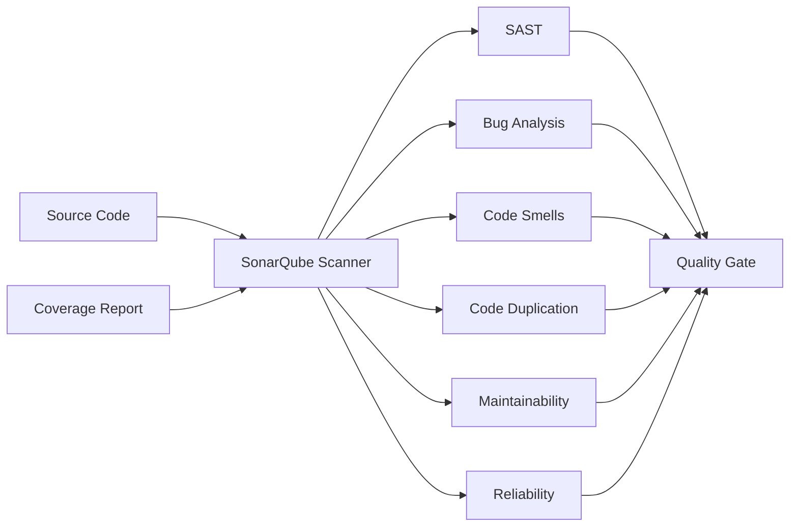

# CI Pipeline Stages

This document describes the recommended Continuous Integration (CI) pipeline for each technology stack used in the OT-Microservices project.

---

# 1. React (Frontend) CI Pipeline

| Stage | CI Step | Recommended Tool / Command | Purpose |
|:----:|--------------------------|--------------------------------------------|--------------------------------------------|
| **1** | Checkout | `git clone` | Fetch source code from SCM |
| **2** | Secret Scanning | `gitleaks detect .` | Detect hardcoded secrets like API keys and passwords |
| **3** | Install Dependencies | `npm ci` | Install dependencies from `package-lock.json` |
| **4** | Code Formatting | `npx prettier --check .` | Validate code formatting |
| **5** | Linting | `npm run lint` | Perform static code analysis using ESLint |
| **6** | Dependency Scan (SCA) | `npm audit --audit-level=high` | Detect vulnerable npm packages |
| **7** | Unit Testing | `CI=true npm test -- --watchAll=false` | Execute Jest unit tests |
| **8** | Code Coverage | `npm test -- --coverage --watchAll=false` | Generate code coverage report |
| **9** | Build/Code Compilation | `CI=false npm run build` | Generate optimized production build |
| **10** | SonarQube Analysis | `sonar-scanner` | Analyze code quality and security |
| **11** | Quality Gate | SonarQube | Validate project quality before deployment |
| **12** | Build Artifact | `build/` | Archive production build |
| **13** | Deploy | Nginx | Deploy static React application |
| **14** | DAST | OWASP ZAP | Perform Dynamic Application Security Testing |

### Notes

- `npm ci` is recommended over `npm install` in CI/CD because it performs a **clean, reproducible installation** using `package-lock.json`.
- `npm ci` removes the existing `node_modules` directory before installing dependencies.
- `CI=true` prevents React tests from entering watch mode inside Jenkins.
- `CI=false` avoids build failures caused by React warnings during production builds.

---

# 2. Java (Spring Boot) CI Pipeline

| Stage | CI Step | Recommended Tool / Command | Purpose |
|:----:|--------------------------|--------------------------------------------|--------------------------------------------|
| **1** | Checkout | `git clone` | Fetch source code |
| **2** | Secret Scanning | `gitleaks detect .` | Detect hardcoded secrets |
| **3** | Dependency Resolution | `mvn dependency:resolve` | Download Maven dependencies |
| **4** | Code Formatting | `mvn spotless:check` | Validate source code formatting |
| **5** | Linting | `mvn checkstyle:check` | Verify Java coding standards |
| **6** | Dependency Scan (SCA) | `mvn org.owasp:dependency-check:check` | Detect vulnerable dependencies |
| **7** | Unit Testing | `mvn test` | Execute JUnit test cases |
| **8** | Code Coverage | `mvn test jacoco:report` | Generate JaCoCo coverage report |
| **9** | Code Complilation | `mvn clean compile` | Compilation creates `target/classes/` |
| **10** | Build | `mvn clean package -DskipTests` | Create executable Spring Boot JAR |
| **11** | SonarQube Analysis | `mvn sonar:sonar` | Analyze code quality |
| **12** | Quality Gate | SonarQube | Validate quality gate |
| **13** | Build Artifact | Spring Boot JAR | Archive deployable artifact |
| **14** | Deploy | `java -jar` / Systemd | Deploy Spring Boot application |
| **15** | DAST | OWASP ZAP | Dynamic security testing |

### Notes

- Always execute **tests before packaging** the application.
- Running `mvn clean package` executes tests by default.
- In CI/CD, a common approach is:
  ```bash
  mvn test
  mvn clean package -DskipTests
  ```
  This prevents tests from running twice while ensuring they have already passed.
- JaCoCo is the standard Java code coverage tool and integrates directly with SonarQube.

---

# 3. Python (Flask) CI Pipeline

| Stage | CI Step | Recommended Tool / Command | Purpose |
|:----:|--------------------------|--------------------------------------------|--------------------------------------------|
| **1** | Checkout | `git clone` | Fetch source code |
| **2** | Secret Scanning | `gitleaks detect .` | Detect secrets in repository |
| **3** | Install Dependencies | `poetry install` | Install project dependencies |
| **4** | Code Formatting | `black --check .` | Validate formatting |
| **5** | Linting | `pylint .` | Static code analysis |
| **6** | Syntax Validation + Bytecode Code Compliation | `python -m py_compile *.py` | Validate Python syntax |
| **7** | Dependency Scan (SCA) | `pip-audit` | Detect vulnerable Python packages |
| **8** | Unit Testing | `pytest` | Execute unit tests |
| **9** | Code Coverage | `pytest --cov=. --cov-report=xml` | Generate coverage report |
| **10** | SonarQube Analysis | `sonar-scanner` | Analyze code quality |
| **11** | Quality Gate | SonarQube | Validate quality gate |
| **12** | Build Artifact | Python Wheel *(Optional)* | Package Python application |
| **13** | Deploy | Gunicorn + Systemd | Deploy Flask application |
| **14** | DAST | OWASP ZAP | Dynamic security testing |

### Notes

- If the project uses **Poetry**, use `poetry install` for dependency management.
- If Poetry is not used, install dependencies with:
  ```bash
  pip install -r requirements.txt
  ```
- `black` is the standard formatter for Python projects.
- `ruff` is a modern, high-performance linter and is becoming popular, but `pylint` remains widely accepted in enterprise projects.
- `pytest` is the de facto standard framework for Python testing.

---

# 4. Go (Gin) CI Pipeline

| Stage | CI Step | Recommended Tool / Command | Purpose |
|:----:|--------------------------|--------------------------------------------|--------------------------------------------|
| **1** | Checkout | `git clone` | Fetch source code |
| **2** | Secret Scanning | `gitleaks detect .` | Detect hardcoded secrets |
| **3** | Install Dependencies | `go mod download` | Download Go modules |
| **4** | Code Formatting | `gofmt -l .` | Validate Go code formatting |
| **5** | Static Analysis | `go vet ./...` | Detect suspicious constructs |
| **6** | Linting | `golangci-lint run` | Run multiple Go linters |
| **7** | Dependency Scan (SCA) | `govulncheck ./...` | Detect known Go vulnerabilities |
| **8** | Unit Testing | `go test ./...` | Execute Go test cases |
| **9** | Code Coverage | `go test -coverprofile=coverage.out ./...` | Generate coverage report |
| **10** | Build/Code Compilation | `go build -o employee-api .` | Build Go executable |
| **11** | SonarQube Analysis | `sonar-scanner` | Analyze code quality |
| **12** | Quality Gate | SonarQube | Validate quality gate |
| **13** | Build Artifact | Go Binary | Archive executable |
| **14** | Deploy | Systemd | Deploy Go application |
| **15** | DAST | OWASP ZAP | Dynamic security testing |

### Notes

- `go mod download` ensures all dependencies are downloaded before compilation.
- `gofmt` is the official Go formatter and should always be executed before linting.
- `go vet` identifies potential coding mistakes that the compiler may not detect.
- `golangci-lint` combines multiple Go linters into a single command and is the industry-standard linting tool.
- `govulncheck` is maintained by the Go team and is recommended for vulnerability scanning of Go modules.
- Go binaries are statically compiled, making deployment simple and portable.
---

# SonarQube Analysis Breakdown


