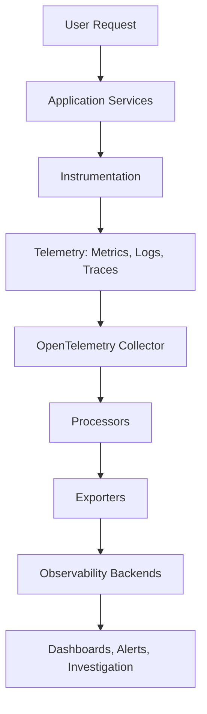

# Part 01 — Foundations of Observability

> **OpenTelemetry Book | OT-Micro-Docker**
>
> A practical, engineering-first introduction to monitoring, observability, telemetry, and the signals used to understand distributed applications.

---

## Table of Contents

- [1. Learning Objectives](#1-learning-objectives)
- [2. Why This Part Matters](#2-why-this-part-matters)
- [3. Monitoring vs Observability](#3-monitoring-vs-observability)
- [4. What Is Telemetry?](#4-what-is-telemetry)
- [5. Why Microservices Need Observability](#5-why-microservices-need-observability)
- [6. The Three Pillars of Observability](#6-the-three-pillars-of-observability)
- [7. The Four Golden Signals](#7-the-four-golden-signals)
- [8. White-Box vs Black-Box Observability](#8-white-box-vs-black-box-observability)
- [9. Health Checks Are Not Observability](#9-health-checks-are-not-observability)
- [10. A Failure Scenario in OT-Micro-Docker](#10-a-failure-scenario-in-ot-micro-docker)
- [11. Observability Architecture](#11-observability-architecture)
- [12. Important Terminology](#12-important-terminology)
- [13. Common Mistakes](#13-common-mistakes)
- [14. Interview Questions — L1](#14-interview-questions--l1)
- [15. Interview Questions — L2](#15-interview-questions--l2)
- [16. Interview Questions — L3](#16-interview-questions--l3)
- [17. Quick Revision Sheet](#17-quick-revision-sheet)
- [18. Final Self-Assessment](#18-final-self-assessment)

---

## 1. Learning Objectives

After completing this part, you should be able to:

- Explain monitoring, observability, telemetry, and instrumentation.
- Differentiate monitoring from observability.
- Explain why distributed systems are harder to troubleshoot than monoliths.
- Describe traces, metrics, and logs at a conceptual level.
- Explain the four golden signals:
  - Latency
  - Traffic
  - Errors
  - Saturation
- Differentiate white-box and black-box monitoring.
- Explain why a simple `/health` endpoint is not enough.
- Map an application failure to the telemetry needed to investigate it.
- Answer beginner, intermediate, and advanced observability interview questions.

---

## 2. Why This Part Matters

Before learning OpenTelemetry, you must understand **what problem OpenTelemetry solves**.

A common beginner mistake is to start with:

> “Which OpenTelemetry package should I install?”

The better first question is:

> “What do I need to know about my application when something goes wrong?”

For example:

- The frontend is loading slowly.
- Employee creation returns HTTP 500.
- Salary generation succeeds but the email never arrives.
- PostgreSQL is reachable, but attendance requests are timing out.
- ScyllaDB is healthy, but the Salary API is returning stale data.
- Notification processing is delayed.
- One API is consuming excessive CPU.
- A request passes through several services and fails somewhere in the middle.

Without observability, you may know **that** something failed but not:

- where it failed,
- why it failed,
- which request was affected,
- which dependency caused the failure,
- how long each component took,
- whether the issue is isolated or widespread.

Observability helps answer these questions using evidence generated by the system.

---

## 3. Monitoring vs Observability

### 3.1 Monitoring

**Monitoring** is the practice of collecting and evaluating predefined signals to determine whether a system is operating within expected limits.

Typical monitoring questions:

- Is the server up?
- Is CPU above 80%?
- Is disk usage above 90%?
- Is the API error rate above 5%?
- Is the database connection count too high?
- Is the application responding to health checks?

Monitoring is excellent for known failure conditions.

Example:

```text
CPU usage > 80%
        |
        v
Alert: High CPU usage
```

Monitoring generally works by defining:

1. A metric or signal.
2. A threshold or expected range.
3. An alert rule.
4. A notification destination.

### 3.2 Observability

**Observability** is the ability to understand the internal state of a system by examining the outputs it produces.

In practical engineering terms:

> Observability helps you investigate unknown problems, not only detect known problems.

Example:

```text
User reports:
"Creating an employee is slow."

Observability investigation:
Frontend
   |
   v
Employee API
   |
   v
ScyllaDB query
   |
   v
Slow response caused by database timeout
```

The system may not have had a predefined alert called:

> “Employee creation is slow because a ScyllaDB query is waiting for a replica.”

But with useful telemetry, an engineer can discover the cause.

### 3.3 Monitoring vs Observability — Comparison

| Aspect | Monitoring | Observability |
|---|---|---|
| Main purpose | Detect known problems | Investigate system behavior |
| Typical question | “Is the system healthy?” | “Why is the system behaving this way?” |
| Data | Often predefined metrics | Metrics, traces, logs, events, profiles |
| Approach | Threshold and alert oriented | Exploratory and evidence oriented |
| Best for | Known failure modes | Unknown or complex failure modes |
| Example | CPU is 90% | Which request caused latency and why? |
| Output | Alert, dashboard, status | Explanation, correlation, diagnosis |
| Scope | Often component focused | Often end-to-end |

### Important Note

Observability does **not** replace monitoring.

A mature platform uses both:

```text
Monitoring
   -> detects and alerts

Observability
   -> investigates and explains
```

---

## 4. What Is Telemetry?

**Telemetry** is data emitted by a system that describes its behavior, activity, and state.

The major telemetry signals are:

1. Metrics
2. Logs
3. Traces

Other useful signals include:

- Profiles
- Events
- Exceptions
- Continuous profiling data
- Runtime and infrastructure measurements

### 4.1 Metrics

A metric is a numerical measurement recorded over time.

Examples:

```text
http_requests_total = 12500
http_request_duration_seconds = 0.245
process_cpu_usage = 62
db_connections_active = 18
```

Metrics are useful for:

- dashboards,
- alerting,
- capacity planning,
- trend analysis,
- SLO calculations.

A metric usually answers:

> “How much, how often, or how many?”

### 4.2 Logs

A log is a timestamped record of an event or message.

Example:

```text
2026-09-12T06:30:15Z ERROR
salary-api
Failed to save salary record
employee_id=E102
reason=database timeout
```

Logs are useful for:

- detailed error messages,
- audit information,
- application state,
- debugging,
- security investigations.

A log usually answers:

> “What happened?”

### 4.3 Traces

A trace represents the journey of a request through one or more services.

Example:

```text
Frontend
  |
  +-- Employee API
        |
        +-- ScyllaDB
```

A trace usually answers:

> “Where did this request spend time, and where did it fail?”

### 4.4 Signals at a Glance

| Signal | Primary question | Example |
|---|---|---|
| Metric | How much/how often? | Request rate = 250 req/s |
| Log | What happened? | Database timeout |
| Trace | Where did the request go? | Frontend → API → DB |
| Profile | Where did compute time go? | Function consumes 40% CPU |

---

## 5. Why Microservices Need Observability

A monolith may look like this:

```text
Client
  |
  v
Monolithic Application
  |
  v
Database
```

A microservice system may look like this:

```text
                    +------------------+
                    |    Frontend      |
                    +--------+---------+
                             |
              +--------------+--------------+
              |              |              |
              v              v              v
       Employee API    Attendance API   Salary API
              |              |              |
              v              v              v
          ScyllaDB       PostgreSQL      ScyllaDB
                                             |
                                             v
                                      Elasticsearch
                                             |
                                             v
                                      Notification API
                                             |
                                             v
                                            SMTP
```

A single user operation may cross:

- browser,
- NGINX,
- API service,
- database,
- cache,
- search index,
- notification service,
- external SMTP server.

### 5.1 Failure Amplification

Suppose the user requests a salary slip.

```text
Browser
  |
  v
Frontend
  |
  v
Salary API
  |
  v
ScyllaDB
  |
  v
Elasticsearch mirror
  |
  v
Notification worker
  |
  v
SMTP server
```

The browser may display:

```text
Salary slip request failed
```

But the real cause could be:

- Salary API failed to write to ScyllaDB.
- ScyllaDB accepted the write but Elasticsearch indexing failed.
- Notification worker could not read the pending record.
- PDF generation failed.
- SMTP authentication failed.
- Email provider rejected the message.
- A retry queue is backed up.

Without distributed tracing and correlated logs, each service may show only a local fragment.

### 5.2 The Main Microservice Problem

> A request is distributed, but the failure is experienced by the user as one operation.

Observability connects the fragments.

---

## 6. The Three Pillars of Observability

The traditional three pillars are:

```text
                 Observability
                      |
       +--------------+--------------+
       |              |              |
       v              v              v
    Metrics         Logs          Traces
```

### 6.1 Metrics — System-Level View

Metrics are ideal for identifying patterns and trends.

Examples:

- Request count.
- Error count.
- Error percentage.
- Request duration.
- CPU and memory usage.
- Database latency.
- Queue depth.
- Active connections.

Example:

```text
http_server_requests_total{service="salary-api"} 18000
```

Metrics are usually cheap to store compared with detailed logs and traces, but labels must be controlled carefully.

### 6.2 Logs — Event-Level Detail

Logs provide detailed information about individual events.

Example:

```json
{
  "timestamp": "2026-09-12T06:30:15Z",
  "level": "ERROR",
  "service": "notification-api",
  "event": "email_send_failed",
  "employee_id": "E102",
  "error": "SMTP authentication failed"
}
```

Good logs should contain:

- timestamp,
- severity,
- service name,
- event name,
- useful identifiers,
- error details,
- correlation identifiers when available.

Bad log:

```text
Something failed
```

Better log:

```text
Notification email failed
employee_id=E102
reason=SMTP authentication failed
retryable=false
```

### 6.3 Traces — Request-Level Journey

A trace consists of spans.

A span represents one timed operation.

Example:

```text
Trace: Generate salary slip

[Frontend request -------------------------------]
    [Salary API --------------------]
        [ScyllaDB query -----]
        [PDF generation -----------]
        [Notification publish --]
```

A trace provides:

- total request duration,
- service-to-service relationships,
- parent-child relationships,
- timing breakdown,
- error location,
- dependency visibility.

### 6.4 Why One Pillar Is Not Enough

#### Metrics without logs

You know:

```text
Error rate increased to 12%.
```

But you may not know:

```text
Which exception caused the errors?
```

#### Logs without traces

You see errors in multiple services but cannot easily determine:

```text
Which logs belong to the same user request?
```

#### Traces without metrics

You can inspect one request, but may not know:

```text
Is this one slow request or a system-wide problem?
```

### 6.5 The Combined Model

```text
Metrics
  -> detect abnormal behavior

Traces
  -> locate the slow or failing path

Logs
  -> explain the detailed event
```

---

## 7. The Four Golden Signals

The four golden signals were popularized by Google SRE practices.

They are:

1. Latency
2. Traffic
3. Errors
4. Saturation

---

### 7.1 Latency

Latency is the time required to complete an operation.

Example:

```text
Employee API request duration = 250 ms
```

Latency should usually be examined as a distribution, not only an average.

Important percentiles:

- p50: median latency.
- p90: 90% of requests are at or below this value.
- p95: 95% of requests are at or below this value.
- p99: 99% of requests are at or below this value.

Example:

```text
p50 = 80 ms
p95 = 450 ms
p99 = 2.4 s
```

Interpretation:

- Most requests are fast.
- A smaller group is slow.
- The slow tail may be affecting real users.

#### Why average latency can mislead

Suppose five requests take:

```text
10 ms, 10 ms, 10 ms, 10 ms, 1000 ms
```

Average:

```text
208 ms
```

The average hides the fact that four requests are fast and one is extremely slow.

---

### 7.2 Traffic

Traffic measures demand placed on a system.

Examples:

- Requests per second.
- Messages per second.
- Transactions per minute.
- Bytes per second.
- Number of active users.

Example:

```text
employee-api request rate = 120 requests/second
notification queue input = 40 messages/second
```

Traffic helps answer:

> “How much work is the system receiving?”

---

### 7.3 Errors

Errors measure failed operations.

Examples:

- HTTP 5xx responses.
- HTTP 4xx responses, depending on the use case.
- Database failures.
- Timeout exceptions.
- Failed message processing.
- SMTP delivery failures.

A useful error rate is:

```text
Error rate =
    failed requests / total requests
```

Example:

```text
Failed requests = 50
Total requests  = 1000

Error rate = 5%
```

Not every 4xx response is a server failure.

For example:

- `400 Bad Request` may indicate invalid user input.
- `401 Unauthorized` may indicate missing authentication.
- `404 Not Found` may be expected in some APIs.
- `500 Internal Server Error` usually indicates server-side failure.

The correct classification depends on the service contract.

---

### 7.4 Saturation

Saturation measures how close a resource is to its limit.

Examples:

- CPU utilization.
- Memory utilization.
- Disk capacity.
- Database connection pool usage.
- Thread pool usage.
- Queue depth.
- File descriptor usage.
- Network bandwidth.

Example:

```text
Database connection pool:
Used = 95
Maximum = 100

Saturation = 95%
```

A service may still be “up” while being saturated.

That is why availability alone is insufficient.

---

### 7.5 Golden Signals Summary

| Signal | Question | Example |
|---|---|---|
| Latency | How long does it take? | p95 = 450 ms |
| Traffic | How much work arrives? | 120 req/s |
| Errors | How much work fails? | 3% error rate |
| Saturation | How full is the system? | DB pool = 95% |

---

## 8. White-Box vs Black-Box Observability

### 8.1 White-Box Monitoring

White-box monitoring examines internal system information.

Examples:

- application metrics,
- JVM metrics,
- Python runtime metrics,
- Go runtime metrics,
- database connection pools,
- internal queue length,
- internal cache hit ratio,
- application logs,
- traces.

White-box question:

> “What is happening inside the system?”

### 8.2 Black-Box Monitoring

Black-box monitoring tests the system from an external point of view.

Examples:

- HTTP probe,
- TCP probe,
- DNS lookup,
- synthetic user journey,
- endpoint availability check,
- external ping.

Black-box question:

> “Does the system work from the outside?”

### 8.3 Comparison

| Aspect | White-box | Black-box |
|---|---|---|
| View | Internal | External |
| Data source | Instrumentation and internal metrics | Probes and synthetic checks |
| Detects | Internal behavior and resource issues | User-visible availability issues |
| Example | DB pool exhaustion | `/health` endpoint fails |
| Requires code instrumentation? | Often yes | Usually no |
| Best use | Diagnosis | Availability verification |

### 8.4 Why Both Are Required

A black-box probe may say:

```text
HTTP endpoint returned 200.
```

But white-box metrics may show:

```text
Error rate = 8%
```

Why?

The probe may test only one route while real users use many routes.

The reverse can also happen:

```text
Internal metrics look healthy.
External probe fails.
```

Possible causes:

- DNS failure,
- load balancer issue,
- TLS issue,
- firewall rule,
- routing problem,
- broken ingress,
- invalid external configuration.

---

## 9. Health Checks Are Not Observability

A health endpoint is useful, but it answers a narrow question.

Example:

```http
GET /health
```

Response:

```json
{
  "status": "UP"
}
```

This tells us very little.

It does not necessarily tell us:

- request latency,
- error distribution,
- database query performance,
- cache hit ratio,
- downstream dependency timing,
- number of affected users,
- which route is failing,
- whether only one employee record is problematic.

### 9.1 Types of Health Checks

#### Liveness

Question:

> “Should this process be restarted?”

Example:

```text
The application process is alive.
```

#### Readiness

Question:

> “Can this instance receive traffic?”

Example:

```text
The service has initialized and can reach required dependencies.
```

#### Startup

Question:

> “Has the application completed startup?”

Example:

```text
The application is still loading configuration and migrations.
```

### 9.2 Health Checks vs Observability

| Feature | Health check | Observability |
|---|---|---|
| Scope | Narrow status | Broad system behavior |
| Typical output | UP/DOWN | Metrics, logs, traces |
| Diagnoses root cause? | Usually no | Often helps |
| Tracks latency? | Not by itself | Yes |
| Tracks dependencies? | Sometimes | Yes |
| Supports historical analysis? | Limited | Yes |

**Rule:**

> A health check tells you whether a component passes a specific test. Observability helps you understand the component and its interactions.

---

## 10. A Failure Scenario in OT-Micro-Docker

Consider this user journey:

```text
User
 |
 v
React Frontend
 |
 v
NGINX
 |
 v
Salary API
 |
 v
ScyllaDB
 |
 v
Notification processing
 |
 v
SMTP
```

The user clicks:

```text
Download and email salary slip
```

The browser reports:

```text
Request failed after 8 seconds
```

### 10.1 What Monitoring Might Show

```text
salary-api error rate = 2%
CPU = 45%
Memory = 60%
ScyllaDB = UP
```

Everything may appear normal.

### 10.2 What Tracing Might Show

```text
Trace duration: 8.1 seconds

Frontend request             8.1 s
  Salary API                 8.0 s
    ScyllaDB query           120 ms
    PDF generation            80 ms
    Notification publish      7.7 s
```

This points toward notification processing.

### 10.3 What Logs Might Show

```text
ERROR notification publish failed
reason=connection timeout
destination=notification-api
timeout=7500ms
trace_id=4bf92f3577b34da6a3ce929d0e0e4736
```

Now the engineer can investigate the exact request across services.

### 10.4 What Saturation Might Show

```text
notification-api worker queue = 98%
```

The likely cause is not ScyllaDB or PDF generation. It is downstream notification saturation.

### 10.5 The Lesson

Each signal answers a different part of the question:

| Question | Useful signal |
|---|---|
| Is the service receiving traffic? | Metrics |
| Is the request slow? | Trace |
| Which operation is slow? | Trace |
| What error occurred? | Logs |
| Is a queue overloaded? | Metrics |
| Which request produced the error? | Trace ID/log correlation |

---

## 11. Observability Architecture

A generic observability architecture looks like this:



### 11.1 Application

The application performs business work.

Examples:

- Employee API.
- Attendance API.
- Salary API.
- Notification API.
- Frontend and NGINX.

### 11.2 Instrumentation

Instrumentation creates telemetry from application activity.

Examples:

- HTTP server request spans.
- Database client spans.
- Runtime metrics.
- Exceptions.
- Application-specific business metrics.

### 11.3 Telemetry

Telemetry is the emitted data:

- metrics,
- logs,
- traces.

### 11.4 Collector

The OpenTelemetry Collector can receive, process, and export telemetry.

Conceptually:

```text
Receive
   |
   v
Process
   |
   v
Export
```

### 11.5 Backend

A backend stores and presents telemetry.

Examples:

- Prometheus for metrics.
- Grafana for visualization.
- Tempo or Jaeger for traces.
- Loki or Elasticsearch for logs.

The backend is not the same thing as OpenTelemetry.

> OpenTelemetry generates, collects, and transports telemetry. A backend stores, queries, visualizes, and alerts on telemetry.

---

## 12. Important Terminology

| Term | Meaning |
|---|---|
| Observability | Understanding internal state from system outputs |
| Monitoring | Detecting known conditions and failures |
| Telemetry | Data emitted by a system |
| Instrumentation | Code or agent that generates telemetry |
| Metric | Numerical measurement over time |
| Log | Timestamped event or message |
| Trace | End-to-end request journey |
| Span | Timed operation within a trace |
| Signal | A telemetry type such as metric, log, or trace |
| Correlation | Connecting related telemetry |
| Cardinality | Number of unique values in a dimension |
| Dashboard | Visual display of telemetry |
| Alert | Notification generated by a rule |
| SLI | Service Level Indicator |
| SLO | Service Level Objective |
| SLA | Service Level Agreement |
| Saturation | Degree to which a resource is consumed |

---

## 13. Common Mistakes

### Mistake 1: “Monitoring and observability are identical.”

They overlap, but they are not identical.

- Monitoring detects known conditions.
- Observability supports investigation and understanding.

### Mistake 2: “A green health check means the application is healthy.”

A health check may cover only one route or one dependency.

### Mistake 3: “CPU and memory are enough.”

Infrastructure metrics do not explain every application failure.

You also need:

- request metrics,
- traces,
- logs,
- dependency metrics,
- business metrics.

### Mistake 4: “Logs alone provide distributed tracing.”

Logs are not automatically connected across services.

Correlation requires identifiers such as:

- trace ID,
- span ID,
- request ID,
- business transaction ID.

### Mistake 5: “Every HTTP 4xx is an application outage.”

Some 4xx responses are expected client behavior.

### Mistake 6: “Average latency is sufficient.”

Tail latency such as p95 and p99 often reveals user-impacting problems.

### Mistake 7: “More telemetry is always better.”

Excessive telemetry can create:

- high storage cost,
- high network usage,
- excessive cardinality,
- noisy dashboards,
- privacy risk,
- operational complexity.

### Mistake 8: “OpenTelemetry is a database.”

OpenTelemetry is not primarily a telemetry storage backend.

### Mistake 9: “The Collector fixes application bugs.”

The Collector transports and processes telemetry. It does not automatically repair broken application logic.

### Mistake 10: “Observability should be added only after production failure.”

Instrumentation is most valuable when designed before incidents occur.

---

## 14. Interview Questions — L1

### Q1. What is monitoring?

Monitoring is the collection and evaluation of predefined signals to detect known system conditions and failures.

### Q2. What is observability?

Observability is the ability to understand the internal state of a system by examining the outputs it produces.

### Q3. What are the three pillars?

- Metrics
- Logs
- Traces

### Q4. What is telemetry?

Telemetry is data emitted by a system describing its behavior, state, and activity.

### Q5. What is the difference between a metric and a log?

A metric is numerical and useful for trends and alerting. A log is an event record containing detailed information.

### Q6. What is a trace?

A trace represents the journey of a request through one or more services.

### Q7. What is a span?

A span represents one timed operation inside a trace.

### Q8. What are the four golden signals?

- Latency
- Traffic
- Errors
- Saturation

### Q9. What is black-box monitoring?

Testing a system from an external perspective, such as probing an HTTP endpoint.

### Q10. Is a health check enough for observability?

No. A health check provides narrow status information. Observability provides broader behavioral evidence.

---

## 15. Interview Questions — L2

### Q1. Why is observability more important in microservices?

Because a single request may cross multiple services and dependencies. Observability connects those distributed operations and helps identify the failure location.

### Q2. Why are traces useful if logs already exist?

Logs contain details, but traces connect operations across services and show timing and parent-child relationships.

### Q3. Why should latency be measured using percentiles?

Averages hide slow-tail behavior. p95 and p99 show the experience of slower requests.

### Q4. Can a service be available but unhealthy?

Yes. It may return HTTP 200 while being slow, partially broken, overloaded, or failing only on specific routes.

### Q5. What is saturation?

Saturation indicates how close a resource is to its limit, such as CPU, memory, database connections, or queue capacity.

### Q6. What is the difference between white-box and black-box monitoring?

White-box uses internal application or infrastructure data. Black-box tests the system externally.

### Q7. What is telemetry correlation?

It is the ability to connect related metrics, logs, and traces using identifiers and shared attributes.

### Q8. Why are business metrics useful?

Technical metrics may look healthy while business operations fail. Business metrics show whether the application is achieving its actual purpose.

Example:

```text
HTTP success rate = 99.9%
Salary emails successfully delivered = 85%
```

### Q9. Why can high-cardinality labels be dangerous?

They create many unique time series, increasing memory, storage, query cost, and operational complexity.

### Q10. Does OpenTelemetry replace Prometheus or Grafana?

No. OpenTelemetry is a telemetry generation and collection framework. Prometheus and Grafana serve storage, querying, visualization, and alerting roles.

---

## 16. Interview Questions — L3

### Q1. A service returns HTTP 200 but users report failure. How do you investigate?

1. Check route-level latency and error metrics.
2. Check traces for the actual user operation.
3. Inspect downstream spans.
4. Check logs correlated by trace ID.
5. Check business metrics.
6. Check black-box probes from the user-facing path.
7. Check dependency saturation and timeouts.

### Q2. CPU is normal, but latency is high. What could be wrong?

Possible causes include:

- database latency,
- network delay,
- lock contention,
- thread or connection pool exhaustion,
- queue backlog,
- external API delay,
- disk I/O wait,
- garbage collection,
- retry storms,
- downstream timeout.

CPU alone is not a complete health indicator.

### Q3. Error rate is low, but users complain about slowness. What should you inspect?

Inspect:

- p95 and p99 latency,
- slow traces,
- database spans,
- queue depth,
- external dependency latency,
- connection pools,
- retry counts,
- saturation metrics.

### Q4. How would you design observability for a salary-slip workflow?

Capture:

- request rate,
- request duration,
- failure rate,
- salary generation duration,
- database operation duration,
- PDF generation duration,
- notification queue depth,
- email success/failure count,
- SMTP response latency,
- trace context across services,
- structured logs with trace correlation.

Avoid putting sensitive salary amounts or personal information into telemetry unless required and protected.

### Q5. Why can excessive observability become a problem?

Because telemetry has cost and risk:

- storage cost,
- ingestion cost,
- CPU overhead,
- network overhead,
- high-cardinality explosion,
- sensitive-data exposure,
- noisy alerts,
- difficult query performance.

### Q6. What is the difference between symptom and cause?

Example:

```text
Symptom:
Salary request takes 8 seconds.

Possible cause:
Notification API connection timeout.

Root cause:
Notification worker pool is saturated due to slow SMTP responses.
```

Observability helps move from symptom to cause.

### Q7. How do you decide which telemetry to collect?

Start with:

1. User journeys.
2. Critical services.
3. Dependencies.
4. Failure modes.
5. SLOs.
6. Security and privacy constraints.
7. Cost and retention requirements.

### Q8. What is the role of observability in incident response?

It supports:

- detection,
- triage,
- impact assessment,
- root-cause analysis,
- mitigation,
- verification,
- post-incident learning.

### Q9. What is an observability blind spot?

A part of the system for which useful telemetry is missing or insufficient.

Examples:

- no trace propagation across a queue,
- no database latency metrics,
- logs without request IDs,
- no metrics for failed background jobs.

### Q10. What is the most important observability principle?

> Instrument the user journey, not only the individual server.

---

## 17. Quick Revision Sheet

### One-line Definitions

```text
Monitoring      = Detect known conditions.
Observability   = Investigate system behavior.
Telemetry       = Data emitted by the system.
Metrics         = Numerical measurements.
Logs            = Event records.
Traces          = Request journeys.
Spans           = Timed operations within traces.
Instrumentation = Mechanism that creates telemetry.
```

### Three Pillars

```text
Metrics -> How much/how often?
Logs    -> What happened?
Traces  -> Where did the request go?
```

### Golden Signals

```text
Latency    -> Time taken
Traffic    -> Work received
Errors     -> Work failed
Saturation -> Resource pressure
```

### White-Box vs Black-Box

```text
White-box -> Internal view
Black-box -> External view
```

### Health Checks

```text
Liveness  -> Should the process restart?
Readiness -> Can it receive traffic?
Startup   -> Has initialization completed?
```

### Core Rule

```text
A green health check does not prove a healthy user experience.
```

---

## 18. Final Self-Assessment

Try answering these without looking at the previous sections.

1. Explain monitoring in one sentence.
2. Explain observability in one sentence.
3. Why is observability needed in microservices?
4. Name the three pillars.
5. Give one example of a metric.
6. Give one example of a structured log.
7. Explain a trace using the frontend-to-database journey.
8. What does p95 latency mean?
9. Explain traffic and saturation.
10. Differentiate white-box and black-box monitoring.
11. Why is `/health` not enough?
12. How would you investigate a slow salary-slip request?
13. Why should traces and logs be correlated?
14. What is an observability blind spot?
15. Why can too much telemetry be dangerous?

### Mastery Standard

You are ready for Part 2 when you can explain:

> “Monitoring tells me that something is wrong. Metrics show the scale, traces show the path, logs show the detailed event, and observability helps me connect the evidence to find the cause.”

---

## References

- [OpenTelemetry Documentation](https://opentelemetry.io/docs/)
- [OpenTelemetry Concepts](https://opentelemetry.io/docs/concepts/)
- [OpenTelemetry Signals](https://opentelemetry.io/docs/concepts/signals/)
- [OpenTelemetry Collector](https://opentelemetry.io/docs/collector/)
- [Google SRE Book — Monitoring Distributed Systems](https://sre.google/sre-book/monitoring-distributed-systems/)

---

**Next part:** Part 02 — OpenTelemetry Core Concepts
