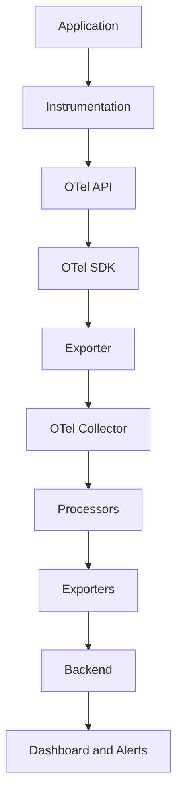

# Part 02 — OpenTelemetry Core Concepts

> **OpenTelemetry Book | OT-Micro-Docker**
>
> Understand what OpenTelemetry is, how its components fit together, and how application code becomes telemetry.

---

## Table of Contents

- [1. Learning Objectives](#1-learning-objectives)
- [2. What Is OpenTelemetry?](#2-what-is-opentelemetry)
- [3. Why OpenTelemetry Was Created](#3-why-opentelemetry-was-created)
- [4. OpenTelemetry Is Not a Backend](#4-opentelemetry-is-not-a-backend)
- [5. OpenTelemetry Architecture](#5-opentelemetry-architecture)
- [6. The Main Components](#6-the-main-components)
- [7. API vs SDK](#7-api-vs-sdk)
- [8. Instrumentation](#8-instrumentation)
- [9. Automatic vs Manual Instrumentation](#9-automatic-vs-manual-instrumentation)
- [10. Resources and Service Identity](#10-resources-and-service-identity)
- [11. Semantic Conventions](#11-semantic-conventions)
- [12. Exporters](#12-exporters)
- [13. Context Propagation](#13-context-propagation)
- [14. OpenTelemetry in OT-Micro-Docker](#14-opentelemetry-in-ot-micro-docker)
- [15. Common Misunderstandings](#15-common-misunderstandings)
- [16. Interview Questions — L1](#16-interview-questions--l1)
- [17. Interview Questions — L2](#17-interview-questions--l2)
- [18. Interview Questions — L3](#18-interview-questions--l3)
- [19. Quick Revision](#19-quick-revision)
- [20. Self-Assessment](#20-self-assessment)

---

## 1. Learning Objectives

After completing this part, you should be able to:

- Define OpenTelemetry precisely.
- Explain why OpenTelemetry is vendor-neutral.
- Describe the relationship between API, SDK, instrumentation, exporters, and Collector.
- Differentiate automatic and manual instrumentation.
- Explain resources and attributes.
- Explain why `service.name` matters.
- Describe semantic conventions.
- Explain how telemetry reaches a backend.
- Explain the role of context propagation.
- Map OpenTelemetry concepts to the OT-Micro-Docker project.

---

## 2. What Is OpenTelemetry?

**OpenTelemetry**, commonly abbreviated as **OTel**, is an open-source, vendor-neutral observability framework for generating, collecting, and exporting telemetry.

It supports the major telemetry signals:

- Traces
- Metrics
- Logs

OpenTelemetry provides:

- APIs for instrumenting applications.
- SDKs for implementing telemetry behavior.
- Instrumentation libraries and agents.
- Exporters for sending telemetry.
- A Collector for receiving, processing, and forwarding telemetry.
- Semantic conventions for consistent naming and attributes.

### Simple Definition

> OpenTelemetry is the instrumentation and telemetry pipeline layer between an application and an observability backend.

### Conceptual Flow

```text
Application
    |
    v
OpenTelemetry Instrumentation
    |
    v
OpenTelemetry API / SDK
    |
    v
Exporter
    |
    v
OpenTelemetry Collector
    |
    v
Backend
```

---

## 3. Why OpenTelemetry Was Created

Before OpenTelemetry, observability tooling was often tightly coupled to a vendor.

For example:

```text
Application
    |
    v
Vendor A SDK
    |
    v
Vendor A Backend
```

If the organization later changed vendors, engineers might need to:

- remove vendor-specific libraries,
- rewrite instrumentation,
- change application code,
- change configuration,
- migrate dashboards,
- redesign data pipelines.

OpenTelemetry aims to reduce this coupling.

### 3.1 Vendor-Neutral Design

With OpenTelemetry:

```text
Application
    |
    v
OpenTelemetry
    |
    +----> Prometheus
    +----> Jaeger
    +----> Tempo
    +----> Datadog
    +----> Elastic
    +----> Other compatible backends
```

The application instrumentation can remain largely the same while exporters or Collector pipelines change.

### 3.2 Benefits

| Benefit | Explanation |
|---|---|
| Vendor neutrality | Avoids locking application instrumentation to one vendor |
| Consistency | Common APIs and naming conventions |
| Distributed tracing | Standard context propagation |
| Multiple signals | Traces, metrics, and logs |
| Ecosystem support | Libraries and agents for many languages |
| Central processing | Collector can transform and route telemetry |
| Migration flexibility | Backend can change without rewriting all application code |

---

## 4. OpenTelemetry Is Not a Backend

This is one of the most important interview concepts.

OpenTelemetry does not primarily act as:

- a long-term time-series database,
- a trace search database,
- a log storage system,
- a dashboarding platform.

Instead:

```text
OpenTelemetry
    -> Creates, collects, and exports telemetry

Backend
    -> Stores, queries, visualizes, and alerts on telemetry
```

### 4.1 Examples

| Component | Main role |
|---|---|
| OpenTelemetry API | Defines instrumentation interfaces |
| OpenTelemetry SDK | Implements telemetry behavior |
| OpenTelemetry Instrumentation | Creates telemetry from application activity |
| OpenTelemetry Collector | Receives, processes, and exports telemetry |
| Prometheus | Metrics storage/querying and alerting ecosystem |
| Grafana | Visualization and dashboards |
| Tempo | Trace backend |
| Jaeger | Trace backend |
| Loki | Log aggregation backend |
| Elasticsearch | Search and analytics backend |

### Important Warning

Installing OpenTelemetry does not automatically give you:

- a dashboard,
- a trace UI,
- metric retention,
- log search,
- alert rules.

You must configure a backend.

---

## 5. OpenTelemetry Architecture

### 5.1 High-Level Architecture



### 5.2 Application Layer

The application contains business logic.

Examples:

- HTTP handlers.
- Database queries.
- Cache calls.
- Message processing.
- PDF generation.
- Email delivery.

### 5.3 Instrumentation Layer

Instrumentation observes application activity and creates telemetry.

Examples:

- A Flask request creates a server span.
- A JDBC query creates a database span.
- A Go HTTP client creates a client span.
- A runtime integration records process metrics.

### 5.4 API Layer

The API defines interfaces used by instrumentation.

The API should allow instrumentation code to request telemetry without depending on a specific SDK implementation.

### 5.5 SDK Layer

The SDK provides the implementation.

It handles concerns such as:

- span creation,
- metric recording,
- sampling,
- batching,
- processing,
- export,
- configuration.

### 5.6 Export Layer

An exporter sends telemetry to another destination.

The destination may be:

- an OpenTelemetry Collector,
- a backend,
- a local debugging output,
- a vendor endpoint.

### 5.7 Collector Layer

The Collector provides a centralized telemetry pipeline:

```text
Receivers
    |
    v
Processors
    |
    v
Exporters
```

A Collector can also contain:

- connectors,
- extensions,
- internal telemetry,
- multiple signal pipelines.

---

## 6. The Main Components

### 6.1 API

The API provides interfaces for instrumentation.

Typical responsibilities:

- acquire a tracer,
- acquire a meter,
- create spans,
- record measurements,
- access context.

The API is designed to be lightweight and stable.

### 6.2 SDK

The SDK provides the actual implementation.

Typical responsibilities:

- configure providers,
- create processors,
- configure exporters,
- manage sampling,
- batch telemetry,
- shut down cleanly.

### 6.3 Instrumentation

Instrumentation generates telemetry from application behavior.

It may be:

- automatic,
- library-based,
- agent-based,
- manual,
- framework-specific.

### 6.4 Exporter

An exporter sends telemetry outside the application process.

Example:

```text
Application SDK
    |
    v
OTLP Exporter
    |
    v
Collector
```

### 6.5 Collector

The Collector is a separate service or process that receives and forwards telemetry.

It can:

- receive OTLP,
- batch data,
- add attributes,
- filter data,
- retry exports,
- route signals,
- send to multiple backends.

---

## 7. API vs SDK

### 7.1 API

The API defines how instrumentation asks for telemetry.

Think of it as an interface or contract.

Example conceptual code:

```python
tracer = trace.get_tracer("employee-api")
```

The instrumentation asks for a tracer without needing to know every SDK implementation detail.

### 7.2 SDK

The SDK determines what happens after instrumentation requests telemetry.

For example:

```text
Span created
    |
    v
Sampler decides whether to record/export
    |
    v
Span processor receives span
    |
    v
Exporter sends span
```

### 7.3 Comparison

| Aspect | API | SDK |
|---|---|---|
| Purpose | Defines interfaces | Implements behavior |
| Main user | Instrumentation authors | Application/platform engineers |
| Contains exporters? | No implementation requirement | Yes, through configuration |
| Contains processors? | No | Yes |
| Controls sampling? | Interface access | Implementation/configuration |
| Main idea | What can be done | How it is done |

### Interview Analogy

```text
API = Electrical socket standard
SDK = Electrical wiring and power system
Instrumentation = Device plugged into the socket
Exporter = Cable carrying the output
```

---

## 8. Instrumentation

**Instrumentation** is the mechanism used to generate telemetry from application activity.

Without instrumentation, the system may have no application-level visibility.

### 8.1 What Can Be Instrumented?

#### HTTP server

```text
Incoming request
    |
    v
Create server span
```

#### HTTP client

```text
Outgoing request
    |
    v
Create client span
```

#### Database

```text
SQL/CQL/JDBC operation
    |
    v
Create database span
```

#### Messaging

```text
Message published or consumed
    |
    v
Create messaging span
```

#### Runtime

```text
Process CPU
Process memory
Garbage collection
Thread activity
```

#### Business operations

```text
salary_slip_generated
employee_created
attendance_marked
notification_sent
```

### 8.2 Technical vs Business Instrumentation

Technical instrumentation:

```text
HTTP request duration
Database query duration
CPU usage
```

Business instrumentation:

```text
Salary slips generated
Emails successfully delivered
Employees created
Attendance records processed
```

A mature observability design uses both.

---

## 9. Automatic vs Manual Instrumentation

### 9.1 Automatic Instrumentation

Automatic instrumentation adds telemetry with minimal or no application-code changes.

It commonly uses:

- agents,
- framework integrations,
- monkey patching,
- bytecode instrumentation,
- runtime hooks,
- instrumentation packages.

Example concept:

```text
Flask application
    |
    v
Install Flask instrumentation
    |
    v
HTTP spans generated automatically
```

### Advantages

- Fast initial setup.
- Good coverage of common frameworks.
- Less application code.
- Useful for standard HTTP and database operations.

### Limitations

- Business logic may remain invisible.
- Custom libraries may not be supported.
- Generated spans may need tuning.
- Sensitive attributes may require filtering.
- Instrumentation behavior depends on library compatibility.

### 9.2 Manual Instrumentation

Manual instrumentation is explicitly added by developers.

Example:

```python
with tracer.start_as_current_span("generate_salary_pdf"):
    generate_pdf()
```

Manual instrumentation is useful for:

- business operations,
- custom workflows,
- important internal functions,
- queue processing,
- custom retry logic,
- domain-specific events.

### Advantages

- Precise control.
- Business context.
- Custom attributes.
- Custom span boundaries.

### Limitations

- Requires code changes.
- Poor span design can create noise.
- Developers must manage errors and attributes carefully.

### 9.3 Automatic vs Manual

| Aspect | Automatic | Manual |
|---|---|---|
| Setup effort | Lower | Higher |
| Framework coverage | Usually strong | Depends on developer |
| Business context | Limited | Strong |
| Code changes | Minimal | Required |
| Control | Lower | High |
| Best use | Standard libraries and HTTP | Business-critical operations |

### Recommended Approach

Use both:

```text
Automatic instrumentation
    +
Manual instrumentation
    =
Useful application observability
```

---

## 10. Resources and Service Identity

A **resource** describes the entity producing telemetry.

Examples of resource information:

- service name,
- service version,
- deployment environment,
- host name,
- process ID,
- container ID,
- cloud region,
- Kubernetes namespace.

### 10.1 Why Resource Attributes Matter

Suppose three services send traces:

```text
employee-api
attendance-api
salary-api
```

If all telemetry has the same or missing service identity, the backend becomes difficult to use.

Resource identity allows filtering:

```text
service.name = "salary-api"
deployment.environment = "dev"
```

### 10.2 Important Service Attributes

| Attribute | Meaning |
|---|---|
| `service.name` | Logical name of the service |
| `service.version` | Version of the running service |
| `deployment.environment.name` | Environment such as dev, staging, prod |
| `service.instance.id` | Specific running instance |
| `host.name` | Host name |
| `cloud.region` | Cloud region |
| `cloud.provider` | Cloud provider |

### 10.3 `service.name`

`service.name` is especially important.

Example:

```text
service.name = employee-api
```

All instances of the same logical service should normally use the same service name.

Correct:

```text
employee-api
employee-api
employee-api
```

Different instance identity can be represented separately:

```text
service.name = employee-api
service.instance.id = employee-api-7f8d9
```

### 10.4 Naming Rule

Use a stable logical name, not a random container ID.

Good:

```text
salary-api
```

Poor:

```text
salary-api-container-8d91a7
```

The container ID changes. The service identity should remain stable.

---

## 11. Semantic Conventions

**Semantic conventions** are standardized names and meanings for telemetry attributes, events, and operations.

Without conventions, different teams may record the same concept differently.

Example without conventions:

```text
service = salary
app = salary-api
application_name = salary-service
```

With a consistent convention:

```text
service.name = salary-api
```

### 11.1 Why Semantic Conventions Matter

They improve:

- consistency,
- interoperability,
- dashboard reuse,
- query portability,
- troubleshooting,
- cross-team understanding.

### 11.2 Examples of Common Concepts

HTTP-related attributes may describe:

- request method,
- response status,
- route,
- server address,
- URL information.

Database-related attributes may describe:

- database system,
- database namespace,
- operation name,
- server address.

Messaging-related attributes may describe:

- messaging system,
- destination,
- operation type,
- message batch information.

### 11.3 Custom Attributes

Custom attributes are useful when standard conventions do not cover your business domain.

Example:

```text
business.operation = salary_slip_generation
employee.type = full_time
notification.channel = email
```

Avoid sensitive or high-cardinality values.

Do not casually add:

```text
employee.salary = 125000
employee.email = mukesh@example.com
full_request_body = ...
```

Telemetry may be stored for long periods and accessed by many operators.

---

## 12. Exporters

An exporter sends telemetry to an external destination.

### 12.1 Common Export Paths

```text
Application
    |
    v
OTLP Exporter
    |
    v
Collector
    |
    v
Backend
```

Or:

```text
Application
    |
    v
Direct Exporter
    |
    v
Backend
```

### 12.2 Direct Export vs Collector Export

#### Direct export

```text
Application -> Backend
```

Advantages:

- fewer components,
- simple proof of concept.

Disadvantages:

- application configuration is tied to backend,
- retry and routing logic may be distributed,
- changing backends can require application changes,
- each service may need separate exporter configuration.

#### Collector export

```text
Application -> Collector -> Backend
```

Advantages:

- centralized processing,
- centralized routing,
- easier backend migration,
- common retry/batching policy,
- reduced application responsibility.

Disadvantages:

- additional component,
- Collector must be monitored,
- network path adds another dependency.

### 12.3 Exporter Types

Conceptually, exporters may send data through:

- OTLP,
- Prometheus-compatible mechanisms,
- logging/debug output,
- vendor-specific protocols,
- backend-specific APIs.

The exact exporter availability depends on the language SDK and deployment.

---

## 13. Context Propagation

Context propagation allows telemetry context to move across process and service boundaries.

A trace context commonly contains:

- trace ID,
- span ID,
- trace flags,
- trace state.

### 13.1 Why Propagation Is Required

Consider:

```text
Frontend
    |
    v
Employee API
    |
    v
ScyllaDB
```

If each service creates an unrelated trace, the backend may show:

```text
Trace A: Frontend
Trace B: Employee API
Trace C: Database
```

With propagation:

```text
One distributed trace
    |
    +-- Frontend span
    +-- Employee API span
    +-- Database span
```

### 13.2 HTTP Propagation

A trace context is commonly carried in HTTP headers.

Conceptually:

```text
Request
  |
  +-- trace context header
  |
  v
Downstream service
```

The downstream service extracts the context and creates a child span.

### 13.3 Propagation Failure Symptoms

- Separate traces for one request.
- Missing parent-child relationships.
- Trace IDs changing unexpectedly.
- Logs cannot be correlated.
- Async worker traces appear disconnected.

### 13.4 Propagation Across Queues

HTTP propagation is not enough for asynchronous systems.

For a queue or message broker, context must be injected into and extracted from message metadata.

Example:

```text
Producer
    |
    +-- inject trace context into message
    |
    v
Queue
    |
    v
Consumer
    |
    +-- extract trace context
    |
    v
Consumer span
```

---

## 14. OpenTelemetry in OT-Micro-Docker

The OT-Micro-Docker project contains multiple services and data stores. OpenTelemetry should be introduced consistently across the service boundaries.

### 14.1 Conceptual Service Map

```text
React Frontend / NGINX
          |
          v
   +------+------+
   |             |
   v             v
Employee API  Attendance API
   |             |
   v             v
ScyllaDB      PostgreSQL

          |
          v
      Salary API
          |
          v
       ScyllaDB
          |
          v
   Elasticsearch mirror
          |
          v
 Notification processing
          |
          v
         SMTP
```

### 14.2 Suggested Service Identity

| Component | Suggested logical service name |
|---|---|
| Employee API | `employee-api` |
| Attendance API | `attendance-api` |
| Salary API | `salary-api` |
| Notification API/worker | `notification-api` or `notification-worker` |
| Frontend | `frontend` |
| NGINX | `nginx` |
| OpenTelemetry Collector | `otel-collector` |

Use names consistently across:

- application configuration,
- traces,
- metrics,
- logs,
- dashboards,
- alerts.

### 14.3 What to Instrument First

#### Employee API

- HTTP server requests.
- Employee creation operation.
- ScyllaDB calls.
- Error handling.
- Request duration.

#### Attendance API

- Flask requests.
- PostgreSQL queries.
- Redis calls.
- Attendance record creation.
- Database timeout errors.

#### Salary API

- HTTP requests.
- ScyllaDB operations.
- Elasticsearch indexing/mirroring.
- Salary generation.
- Error and timeout paths.

#### Notification Service

- Pending-record polling.
- Elasticsearch reads.
- PDF generation.
- SMTP calls.
- Retry count.
- Email success/failure.
- Queue or pending-record age.

### 14.4 Important Business Spans

Example span names:

```text
employee.create
attendance.mark
salary.generate
salary.persist
salary.index
notification.process
salary_pdf.generate
email.send
```

Span names should be:

- stable,
- meaningful,
- low-cardinality,
- independent of employee IDs.

Bad:

```text
generate_salary_for_E102
```

Good:

```text
salary.generate
```

Store the employee identifier only when necessary, and protect sensitive information.

### 14.5 Instrumentation Strategy

```text
Phase 1:
HTTP server instrumentation

Phase 2:
Database and cache instrumentation

Phase 3:
Manual business spans

Phase 4:
Trace/log correlation

Phase 5:
Metrics, dashboards, and alerts
```

### Important Project Note

The exact instrumentation method depends on the implementation language and libraries:

- Python services may use Python SDKs and framework integrations.
- Java services may use Java agents or SDK instrumentation.
- Go services generally use SDK packages and explicit instrumentation.
- React and NGINX require separate frontend/server observability decisions.

Do not assume that one instrumentation package works identically for every language.

---

## 15. Common Misunderstandings

### Misunderstanding 1: OpenTelemetry is only tracing

Incorrect.

OpenTelemetry supports:

- traces,
- metrics,
- logs.

### Misunderstanding 2: OpenTelemetry automatically instruments every line of code

Incorrect.

Automatic instrumentation covers supported frameworks and libraries. Business logic often needs manual instrumentation.

### Misunderstanding 3: The SDK and API are the same

Incorrect.

The API defines interfaces. The SDK implements telemetry behavior.

### Misunderstanding 4: The Collector is mandatory

Not always.

You can export directly to a backend, but a Collector is often valuable for centralized processing and routing.

### Misunderstanding 5: `service.name` should contain the container ID

Usually incorrect.

Use a stable logical service name. Represent instance identity separately.

### Misunderstanding 6: More span attributes always improve observability

Not necessarily.

Excessive attributes may create:

- sensitive-data exposure,
- high-cardinality queries,
- increased storage cost,
- noisy traces.

### Misunderstanding 7: A backend and OpenTelemetry are interchangeable

Incorrect.

OpenTelemetry produces and transports telemetry. Backends store and analyze it.

### Misunderstanding 8: Context propagation happens automatically across every boundary

Incorrect.

Propagation must be supported and configured across:

- HTTP,
- messaging,
- asynchronous tasks,
- custom protocols.

---

## 16. Interview Questions — L1

### Q1. What is OpenTelemetry?

OpenTelemetry is an open-source, vendor-neutral framework for generating, collecting, and exporting telemetry.

### Q2. What signals does OpenTelemetry support?

- Traces
- Metrics
- Logs

### Q3. Is OpenTelemetry a backend?

No. It is primarily an instrumentation and telemetry collection framework.

### Q4. What is instrumentation?

Instrumentation is the mechanism that generates telemetry from application activity.

### Q5. What is an exporter?

An exporter sends telemetry to an external destination.

### Q6. What is the OpenTelemetry Collector?

A service that receives, processes, and exports telemetry.

### Q7. What is `service.name`?

A resource attribute identifying the logical service that produced telemetry.

### Q8. What is semantic convention?

A standardized naming and meaning scheme for telemetry attributes and operations.

### Q9. What is automatic instrumentation?

Instrumentation that generates telemetry with minimal application-code changes.

### Q10. What is manual instrumentation?

Instrumentation explicitly added by developers for custom operations or business logic.

---

## 17. Interview Questions — L2

### Q1. Explain API vs SDK.

The API defines instrumentation interfaces. The SDK implements telemetry behavior such as sampling, processing, and exporting.

### Q2. Why is OpenTelemetry vendor-neutral?

It defines common APIs, SDKs, protocols, and conventions so applications are not tightly coupled to one observability vendor.

### Q3. Why use a Collector?

A Collector centralizes:

- receiving,
- processing,
- batching,
- filtering,
- retrying,
- routing,
- exporting.

### Q4. What is the difference between direct export and Collector export?

Direct export sends telemetry from the application to a backend. Collector export sends telemetry through a separate processing and routing layer.

### Q5. Why is automatic instrumentation not enough?

It may not understand custom business operations, internal workflows, or domain-specific failures.

### Q6. Why is `service.name` important?

It allows operators to identify and filter telemetry by logical service.

### Q7. What are semantic conventions used for?

They provide consistent attribute names and meanings across services and teams.

### Q8. Why is context propagation important?

It connects spans created by different services into one distributed trace.

### Q9. Can one application use both automatic and manual instrumentation?

Yes. This is often the recommended approach.

### Q10. What happens if trace context is not propagated?

Distributed traces become disconnected and logs may not correlate correctly.

---

## 18. Interview Questions — L3

### Q1. Design an OpenTelemetry architecture for OT-Micro-Docker.

A strong answer should include:

1. Instrument each application according to its language.
2. Set stable resource attributes.
3. Export OTLP telemetry to a Collector.
4. Use Collector pipelines for traces, metrics, and logs.
5. Apply batching, filtering, and resource enrichment.
6. Export to suitable backends.
7. Correlate logs with trace IDs.
8. Monitor the Collector itself.
9. Protect sensitive business data.
10. Define retention, sampling, and alerting policies.

### Q2. Why should service identity be separate from instance identity?

A logical service may have many instances. Dashboards and service-level queries should group instances under one stable service name while still allowing individual-instance troubleshooting.

### Q3. How would you instrument a salary-slip workflow?

Use automatic HTTP/database instrumentation plus manual spans for:

```text
salary.generate
salary.persist
salary.index
notification.process
salary_pdf.generate
email.send
```

Add useful low-cardinality attributes and propagate context across service and messaging boundaries.

### Q4. Why might a trace be incomplete even when instrumentation is installed?

Possible causes:

- missing instrumentation for a library,
- context propagation failure,
- unsupported async boundary,
- exporter failure,
- sampling,
- service misconfiguration,
- span ended too early,
- Collector pipeline failure.

### Q5. How can OpenTelemetry create operational risk?

Potential risks include:

- telemetry overhead,
- excessive cardinality,
- sensitive-data exposure,
- exporter backpressure,
- Collector overload,
- excessive storage cost,
- noisy instrumentation.

### Q6. Should every function create a span?

No.

Create spans for meaningful operations and boundaries. Spanning every small function can create excessive noise and overhead.

### Q7. How do you choose between automatic and manual instrumentation?

Use automatic instrumentation for common frameworks and libraries. Add manual instrumentation where business context or unsupported operations are important.

### Q8. What happens if the Collector is unavailable?

The SDK/exporter behavior depends on configuration. Telemetry may be queued temporarily, retried, dropped, or cause overhead if buffers fill. The application should not become unavailable merely because telemetry export is temporarily failing.

### Q9. How do you prevent telemetry from exposing salary information?

- Do not record salary amounts by default.
- Avoid full request/response bodies.
- Redact sensitive attributes.
- Use stable non-sensitive identifiers where possible.
- Restrict backend access.
- Apply retention and encryption controls.
- Review instrumentation before production.

### Q10. What is the difference between application instrumentation and Collector configuration?

Application instrumentation creates telemetry. Collector configuration controls how received telemetry is processed and exported.

---

## 19. Quick Revision

```text
OpenTelemetry
    = Generate + collect + export telemetry

API
    = Defines interfaces

SDK
    = Implements telemetry behavior

Instrumentation
    = Creates telemetry from application activity

Exporter
    = Sends telemetry elsewhere

Collector
    = Receives + processes + exports telemetry

Resource
    = Describes the telemetry-producing entity

service.name
    = Stable logical service identity

Semantic conventions
    = Standardized names and meanings

Context propagation
    = Connects telemetry across service boundaries
```

### The Most Important Flow

```text
Application
    |
    v
Instrumentation
    |
    v
API
    |
    v
SDK
    |
    v
Exporter
    |
    v
Collector
    |
    v
Backend
```

### One-Minute Interview Answer

> OpenTelemetry is a vendor-neutral framework for generating, collecting, and exporting traces, metrics, and logs. Applications use instrumentation through the OpenTelemetry API and SDK. Exporters send telemetry directly to a backend or through an OpenTelemetry Collector. The Collector can receive, process, batch, filter, and route telemetry. Resources such as `service.name` identify the source, semantic conventions standardize attributes, and context propagation connects operations across service boundaries.

---

## 20. Self-Assessment

Answer these without looking back:

1. Define OpenTelemetry.
2. Why is OpenTelemetry vendor-neutral?
3. Is OpenTelemetry a backend?
4. Explain API vs SDK.
5. What is instrumentation?
6. Compare automatic and manual instrumentation.
7. What is the role of an exporter?
8. What does the Collector do?
9. Why is `service.name` important?
10. What are semantic conventions?
11. Why is context propagation required?
12. Can the Collector be skipped?
13. Why should every function not become a span?
14. How would you instrument the salary-slip workflow?
15. What telemetry data should not be recorded in a salary system?

### Mastery Standard

You are ready for Part 3 when you can explain:

> “OpenTelemetry instruments the application, the API and SDK create and manage telemetry, exporters send it, the Collector processes and routes it, resources identify the source, semantic conventions standardize the data, and context propagation connects distributed operations.”

---

## References

- [OpenTelemetry Documentation](https://opentelemetry.io/docs/)
- [What Is OpenTelemetry?](https://opentelemetry.io/docs/what-is-opentelemetry/)
- [OpenTelemetry Concepts](https://opentelemetry.io/docs/concepts/)
- [OpenTelemetry Components](https://opentelemetry.io/docs/concepts/components/)
- [OpenTelemetry Signals](https://opentelemetry.io/docs/concepts/signals/)
- [OpenTelemetry Context Propagation](https://opentelemetry.io/docs/concepts/context-propagation/)
- [OpenTelemetry Semantic Conventions](https://opentelemetry.io/docs/specs/semconv/)

---

**Next part:** Part 03 — Distributed Tracing in Depth
