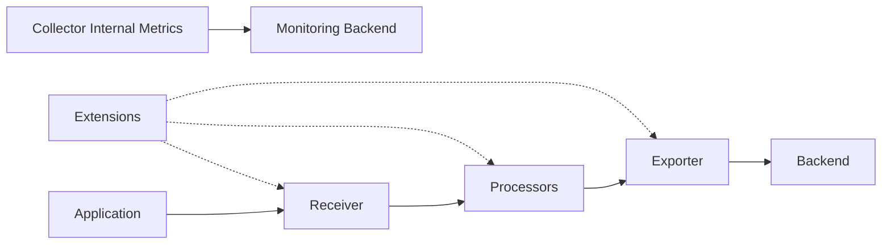
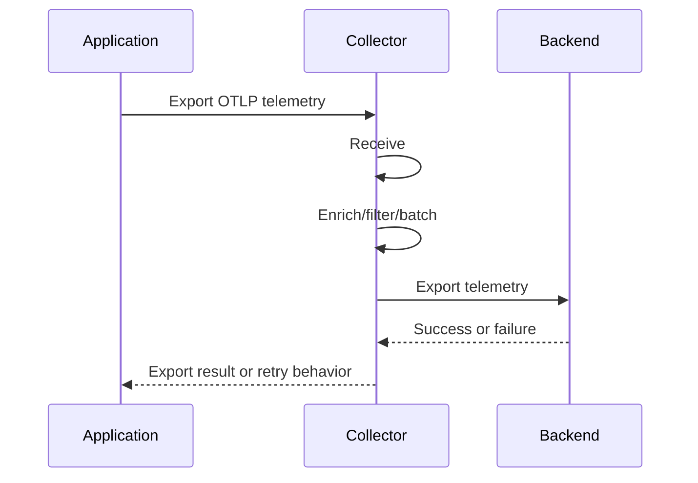
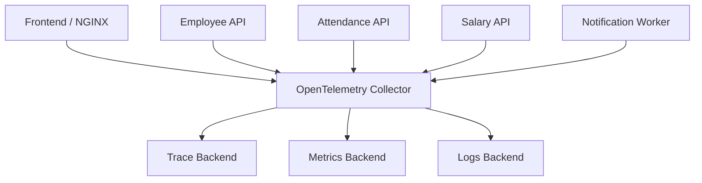

# Part 05 — OpenTelemetry Collector in Depth

> **Series:** OpenTelemetry for OT-Micro-Docker  
> **Level:** Beginner → Intermediate → Advanced  
> **Focus:** Collector architecture, receivers, processors, exporters, pipelines, deployment, scaling, security, and troubleshooting

---

## Table of Contents

1. Learning Objectives
2. What Is the OpenTelemetry Collector?
3. Why Use a Collector?
4. Collector Architecture
5. Core Collector Components
6. Receivers
7. Processors
8. Exporters
9. Connectors
10. Extensions
11. Service and Pipelines
12. Telemetry Flow
13. Agent vs Gateway
14. Collector Deployment Models
15. OTLP
16. Collector Configuration
17. Important Processors
18. Batch Processor
19. Memory Limiter
20. Resource Detection
21. Attributes and Resource Processors
22. Filtering and Transforming Telemetry
23. Exporting to Backends
24. Collector Internal Telemetry
25. Security
26. Reliability and Backpressure
27. Scaling
28. OT-Micro-Docker Collector Architecture
29. Example Collector Configuration
30. Troubleshooting
31. Common Mistakes
32. L1 Interview Questions
33. L2 Interview Questions
34. L3 Interview Questions
35. Quick Revision
36. Self-Assessment
37. Final Checklist

---

# 1. Learning Objectives

After completing this part, you should be able to:

- Explain what the OpenTelemetry Collector does.
- Describe receivers, processors, exporters, connectors, extensions, and service pipelines.
- Explain the difference between an agent and a gateway Collector.
- Understand OTLP and Collector configuration.
- Design a Collector for OT-Micro-Docker.
- Use batching, memory limiting, resource detection, filtering, and transformation.
- Understand retries, queues, backpressure, and failure handling.
- Explain Collector scaling and high availability.
- Secure telemetry in transit.
- Troubleshoot telemetry that is not reaching a backend.
- Answer Collector-related L1, L2, and L3 interview questions.

---

# 2. What Is the OpenTelemetry Collector?

The **OpenTelemetry Collector** is a vendor-neutral service that receives, processes, and exports telemetry.

It can handle:

```text
Traces
Metrics
Logs
```

A Collector can:

- Receive telemetry from applications.
- Receive telemetry from other Collectors.
- Add or modify metadata.
- Filter unwanted telemetry.
- Batch data.
- Limit memory usage.
- Retry failed exports.
- Export to one or more backends.
- Provide a central control point for observability.

## Simple definition

> The OpenTelemetry Collector is a telemetry pipeline engine.

It is not:

- A database.
- A dashboard.
- A tracing backend.
- A metrics query engine.
- A replacement for Grafana.
- A replacement for Prometheus.
- An application runtime.

The Collector transports and processes telemetry. A backend stores and queries it.

---

# 3. Why Use a Collector?

Applications can export telemetry directly to a backend, but a Collector provides several advantages.

## Without a Collector

```text
Application
    |
    v
Backend
```

Every application must know:

- Backend endpoint.
- Authentication.
- Retry behavior.
- Export format.
- TLS configuration.
- Sampling or filtering policy.

## With a Collector

```text
Application
    |
    v
OpenTelemetry Collector
    |
    +── Metrics backend
    +── Trace backend
    +── Log backend
```

Applications only need to know the Collector endpoint.

## Main benefits

### 3.1 Vendor Neutrality

Applications export OTLP instead of being tightly coupled to a backend.

### 3.2 Centralized Processing

The Collector can apply:

- Batching.
- Filtering.
- Redaction.
- Resource enrichment.
- Sampling.
- Routing.

### 3.3 Reduced Application Complexity

Application code does not need to implement every backend-specific feature.

### 3.4 Operational Control

The Collector can be updated or reconfigured independently from application deployments.

### 3.5 Multiple Destinations

One telemetry stream can be exported to several destinations.

Example:

```text
Traces
  ├── Tracing backend
  └── Archive backend
```

Use multiple destinations carefully because this increases cost and operational complexity.

---

# 4. Collector Architecture

The Collector is composed of modular components.



A more complete view:

```text
                OpenTelemetry Collector
┌─────────────────────────────────────────────────────┐
│                                                     │
│  Receivers → Processors → Exporters                 │
│       ↑           ↑           ↑                     │
│       └────── Service Pipelines ──────┘             │
│                                                     │
│  Extensions: health, auth, diagnostics, zPages      │
│                                                     │
│  Internal telemetry: Collector health and metrics   │
└─────────────────────────────────────────────────────┘
```

---

# 5. Core Collector Components

| Component | Responsibility |
|---|---|
| Receiver | Accepts telemetry |
| Processor | Modifies, filters, batches, or enriches telemetry |
| Exporter | Sends telemetry to a destination |
| Connector | Connects one pipeline to another |
| Extension | Adds optional Collector capabilities |
| Service | Defines enabled pipelines and extensions |

## Typical pipeline

```text
Receiver
   ↓
Memory Limiter
   ↓
Resource Processor
   ↓
Batch Processor
   ↓
Exporter
```

The order matters. A processor that depends on a field must run after the field is available.

---

# 6. Receivers

A receiver accepts telemetry into the Collector.

Receivers can receive:

- OTLP over gRPC.
- OTLP over HTTP.
- Prometheus scrape data.
- Jaeger protocols.
- Zipkin protocols.
- Host metrics.
- File logs.
- Other supported formats.

## Common receivers

### OTLP Receiver

Used by OpenTelemetry SDKs and other OTLP clients.

```text
Application → OTLP receiver
```

### Prometheus Receiver

Scrapes Prometheus-format metrics from endpoints.

```text
Collector → scrape target
```

### Host Metrics Receiver

Collects host-level metrics such as:

- CPU.
- Memory.
- Disk.
- Network.
- Load.

### Filelog Receiver

Reads logs from files.

Useful when applications write logs to:

```text
/var/log/application.log
```

## Receiver responsibility

A receiver should focus on ingestion.

It should not be expected to:

- Store long-term data.
- Build dashboards.
- Replace a backend.
- Perform all transformations.

---

# 7. Processors

Processors operate on telemetry after it is received and before it is exported.

Common processor responsibilities:

- Add resource attributes.
- Rename or modify attributes.
- Drop unwanted data.
- Batch telemetry.
- Limit memory.
- Sample traces.
- Redact sensitive information.
- Route telemetry.
- Transform data.

## Common processors

| Processor | Purpose |
|---|---|
| `batch` | Groups telemetry before export |
| `memory_limiter` | Prevents excessive memory usage |
| `resource` | Updates resource attributes |
| `attributes` | Adds, updates, or deletes attributes |
| `filter` | Drops telemetry matching conditions |
| `transform` | Applies transformations |
| `probabilistic_sampler` | Samples traces probabilistically |
| `tail_sampling` | Samples traces after observing complete traces |
| `routing` | Routes telemetry to different pipelines |

Processors are generally applied in the order listed in the pipeline.

---

# 8. Exporters

An exporter sends telemetry from the Collector to a destination.

Possible destinations:

- OTLP backend.
- Prometheus-compatible endpoint.
- Jaeger-compatible backend.
- Loki-compatible log backend.
- Cloud observability platform.
- Debug output.
- File or other supported storage destination.

## Exporter examples

```text
otlp
otlphttp
prometheus
debug
```

The exact exporter availability depends on the Collector distribution and build.

## Important

A configured exporter does not automatically become active.

It must be referenced by a service pipeline.

Example concept:

```yaml
exporters:
  debug: {}

service:
  pipelines:
    traces:
      exporters: [debug]
```

---

# 9. Connectors

A connector links one pipeline to another.

This allows telemetry to flow between pipelines or to be transformed into another signal.

Conceptual example:

```text
Traces pipeline
    |
    v
Connector
    |
    v
Metrics pipeline
```

Connectors can be useful for:

- Deriving metrics from spans.
- Routing telemetry.
- Connecting signal pipelines.
- Building service graphs or span-derived metrics.

## Connector vs exporter

| Connector | Exporter |
|---|---|
| Connects Collector pipelines | Sends data outside the Collector |
| Internal pipeline handoff | External destination |
| May create or transform signals | Usually transports telemetry |
| Used inside Collector architecture | Used at pipeline boundary |

---

# 10. Extensions

Extensions provide optional Collector functionality that is not part of the main telemetry pipeline.

Examples include:

- Health check endpoint.
- Authentication.
- Diagnostic pages.
- Configuration support.
- Memory ballast in older configurations.
- Runtime extensions.

A health-check extension can expose an endpoint that orchestration systems use for liveness or readiness checks.

## Extension flow

```text
Kubernetes / load balancer
          |
          v
Collector health endpoint
```

A healthy process does not necessarily mean telemetry is being exported successfully. Health checks should be combined with Collector internal metrics.

---

# 11. Service and Pipelines

The `service` section controls what actually runs.

A Collector configuration can define components that are never used. Only components referenced by active pipelines or extensions are started.

## Pipeline types

```text
traces
metrics
logs
```

Example:

```yaml
service:
  pipelines:
    traces:
      receivers: [otlp]
      processors: [memory_limiter, batch]
      exporters: [otlp]

    metrics:
      receivers: [otlp]
      processors: [memory_limiter, batch]
      exporters: [otlp]

    logs:
      receivers: [otlp]
      processors: [memory_limiter, batch]
      exporters: [otlp]
```

## Important

A receiver can be used by multiple pipelines.

Example:

```yaml
receivers:
  otlp:
    protocols:
      grpc: {}
      http: {}
```

The same OTLP receiver can feed traces, metrics, and logs pipelines.

---

# 12. Telemetry Flow

A typical application-to-backend flow:



## Detailed flow

```text
1. Application creates telemetry.
2. SDK exports telemetry using OTLP.
3. Collector receiver accepts it.
4. Memory limiter checks resource pressure.
5. Resource processor enriches metadata.
6. Filter/transform processors modify data.
7. Batch processor groups records.
8. Exporter sends records to backend.
9. Backend acknowledges or rejects data.
10. Collector records internal metrics.
```

---

# 13. Agent vs Gateway

There are two common deployment patterns.

## 13.1 Agent Collector

An agent runs close to the workload.

Examples:

- One Collector per host.
- One Collector per Kubernetes node.
- Sidecar Collector.
- Local daemon process.

```text
Application
    |
    v
Local Agent Collector
    |
    v
Gateway or Backend
```

### Advantages

- Local collection.
- Reduced application-to-network complexity.
- Host log and metric access.
- Local buffering.
- Node-level enrichment.

### Disadvantages

- More Collector instances.
- More configuration distribution.
- More operational overhead.

## 13.2 Gateway Collector

A gateway is a centralized Collector service.

```text
Application A ─┐
Application B ─┼──> Gateway Collector ──> Backends
Application C ─┘
```

### Advantages

- Centralized configuration.
- Centralized filtering and sampling.
- Easier backend credential management.
- Fewer network destinations for applications.

### Disadvantages

- Potential bottleneck.
- Central failure domain if deployed as one instance.
- Network dependency.
- Requires scaling and high availability.

## Agent vs Gateway

| Agent | Gateway |
|---|---|
| Runs close to workload | Runs centrally |
| Good for host logs and metrics | Good for centralized processing |
| Many instances | Fewer larger instances |
| Local buffering | Central buffering |
| Node-level enrichment | Organization-wide policies |

---

# 14. Collector Deployment Models

## 14.1 Direct Application → Collector

```text
Application → Collector → Backend
```

Simple and suitable for small environments.

## 14.2 Application → Agent → Gateway → Backend

```text
Application
    ↓
Agent Collector
    ↓
Gateway Collector
    ↓
Backend
```

Useful for larger environments.

## 14.3 Sidecar Collector

```text
Pod
├── Application container
└── Collector sidecar
```

Advantages:

- Strong workload isolation.
- Local communication.
- Per-application configuration.

Disadvantages:

- One Collector per workload.
- Higher resource overhead.
- More complex lifecycle management.

## 14.4 DaemonSet Collector

In Kubernetes, a Collector can run as a DaemonSet.

```text
Node A → Collector
Node B → Collector
Node C → Collector
```

Useful for:

- Node metrics.
- Container logs.
- Local telemetry collection.

## 14.5 Deployment Collector

A Collector can run as a Deployment with multiple replicas.

Useful for:

- Gateway processing.
- Centralized OTLP ingestion.
- Load-balanced exports.

---

# 15. OTLP

**OTLP** stands for OpenTelemetry Protocol.

It is the standard protocol used to transmit OpenTelemetry telemetry.

Common transport options:

```text
OTLP/gRPC
OTLP/HTTP
```

## OTLP/gRPC

Often uses port:

```text
4317
```

## OTLP/HTTP

Often uses port:

```text
4318
```

The exact endpoint and path depend on configuration.

## Example

```text
Application SDK
    |
    | OTLP/gRPC or OTLP/HTTP
    v
Collector
```

## Common connectivity problems

- Wrong hostname.
- Wrong port.
- TLS mismatch.
- HTTP sent to gRPC endpoint.
- gRPC sent to HTTP endpoint.
- Firewall or security group issue.
- Collector not listening.
- DNS failure.
- Authentication failure.

---

# 16. Collector Configuration

Collector configuration is usually YAML.

A configuration commonly contains:

```yaml
receivers:
processors:
exporters:
extensions:
service:
```

## Minimal conceptual configuration

```yaml
receivers:
  otlp:
    protocols:
      grpc:
      http:

processors:
  batch:

exporters:
  debug:

service:
  pipelines:
    traces:
      receivers: [otlp]
      processors: [batch]
      exporters: [debug]
```

## Configuration logic

```text
Define component
    ↓
Reference component in service
    ↓
Collector starts component
```

Defining a receiver without referencing it does not make it active.

---

# 17. Important Processors

## 17.1 `batch`

Groups telemetry to improve export efficiency.

## 17.2 `memory_limiter`

Protects the Collector from excessive memory usage.

## 17.3 `resource`

Adds or updates resource attributes.

## 17.4 `attributes`

Adds, updates, hashes, or deletes attributes.

## 17.5 `filter`

Drops telemetry based on conditions.

## 17.6 `transform`

Changes telemetry using transformation statements.

## 17.7 Sampling Processors

Sampling reduces trace volume.

Two broad approaches:

```text
Head sampling
Tail sampling
```

Head sampling makes a decision early. Tail sampling waits until more of the trace is available.

---

# 18. Batch Processor

The batch processor groups telemetry before exporting it.

## Why batching helps

Without batching:

```text
Export 1 span
Export 1 span
Export 1 span
Export 1 span
```

With batching:

```text
Export 100 spans together
```

Benefits:

- Fewer network calls.
- Better throughput.
- Lower per-request overhead.
- More efficient backend ingestion.

## Trade-off

Batching introduces a small delay.

If the batch is not full, the Collector may wait until a timeout.

## Batch tuning

Important parameters conceptually include:

- Batch size.
- Maximum batch size.
- Timeout.

Too small:

```text
Many small exports
```

Too large:

```text
Higher memory usage
Longer waiting time
```

---

# 19. Memory Limiter

The memory limiter helps prevent out-of-memory conditions.

A Collector may accumulate memory because of:

- Large batches.
- Backend slowness.
- Export retries.
- High telemetry volume.
- Large log records.
- Queue growth.

## Conceptual behavior

```text
Memory usage rises
       |
       v
Memory limiter applies pressure
       |
       +── Refuses or drops data according to behavior
       +── Causes upstream retry/backpressure
```

The memory limiter should generally be placed early in pipelines.

## Important

The memory limiter is not a replacement for:

- Correct sizing.
- Batch tuning.
- Exporter queues.
- Load testing.
- Monitoring.

---

# 20. Resource Detection

Resource detection identifies information about the environment where telemetry is produced or collected.

Possible resource information:

```text
Host name
Cloud provider
Cloud region
Availability zone
Container ID
Kubernetes namespace
Kubernetes pod
```

For AWS-based OT-Micro-Docker infrastructure, useful metadata may include:

```text
cloud.provider = aws
cloud.region = us-east-1
deployment.environment.name = dev
```

Resource enrichment makes it easier to filter dashboards and compare instances.

## Resource vs attributes

```text
Resource:
  service.name = salary-api
  cloud.region = us-east-1

Span attribute:
  db.operation.name = SELECT
  http.response.status_code = 500
```

---

# 21. Attributes and Resource Processors

## Attributes processor

Used to modify telemetry attributes.

Possible actions:

- Insert.
- Update.
- Upsert.
- Delete.
- Hash.
- Extract.

Example use cases:

```text
Remove sensitive header
Add deployment environment
Normalize an attribute
Hash a sensitive identifier
```

## Resource processor

Used for resource-level metadata.

Example:

```text
service.name = salary-api
service.version = 1.4.2
deployment.environment.name = dev
```

## Warning

Do not blindly add high-cardinality values to every telemetry record.

Avoid adding:

```text
employee_id
request_id
session_id
```

as metric dimensions.

---

# 22. Filtering and Transforming Telemetry

Filtering is useful for:

- Dropping health-check traces.
- Removing debug logs in production.
- Excluding noisy endpoints.
- Reducing sensitive data.
- Routing only relevant telemetry.

## Example filtering goals

```text
Drop:
  /health
  /ready
  /metrics
```

This can reduce noise, but be careful:

- Health checks may be useful during incidents.
- Dropping all errors is dangerous.
- Filtering rules should be documented.
- Validate filters before production use.

## Transformation examples

```text
Rename an attribute
Normalize service names
Convert a field
Redact a value
Add a derived attribute
```

Always test transformations with representative telemetry.

---

# 23. Exporting to Backends

The Collector can export each signal to an appropriate backend.

Example:

```text
Traces  → Trace backend
Metrics → Prometheus-compatible backend
Logs    → Log backend
```

## One pipeline, multiple exporters

A pipeline may export to more than one destination.

```text
Traces
  ├── Primary trace backend
  └── Secondary archive
```

## Multiple pipelines

Separate pipelines can use different processing rules.

```text
Traces:
  sampling + batch

Metrics:
  resource + batch

Logs:
  redaction + batch
```

## Backend failure

If the backend is unavailable:

- Export attempts may fail.
- Exporter retry logic may activate.
- Queues may grow.
- Memory pressure may increase.
- Data may eventually be dropped.

The Collector must be monitored for export failures and queue growth.

---

# 24. Collector Internal Telemetry

The Collector itself must be observable.

Important internal measurements include:

- Received telemetry count.
- Exported telemetry count.
- Export failures.
- Processor errors.
- Queue size.
- Queue capacity.
- Memory usage.
- CPU usage.
- Receiver refusal count.
- Dropped telemetry.
- Retry count.
- Pipeline throughput.

## Why internal telemetry matters

Suppose the application reports:

```text
Traces generated = 10,000
```

But the backend receives:

```text
Traces received = 6,000
```

Collector internal metrics can help identify whether the loss occurred because of:

- Receiver failure.
- Processor filtering.
- Memory pressure.
- Export failure.
- Queue overflow.
- Network failure.

## Important principle

> Monitor the monitoring system.

---

# 25. Security

Telemetry can contain sensitive operational and personal information.

## 25.1 TLS

Use TLS when telemetry crosses untrusted networks.

```text
Application → TLS → Collector
Collector → TLS → Backend
```

## 25.2 Authentication

Possible mechanisms include:

- API keys.
- Bearer tokens.
- Mutual TLS.
- Cloud identity.
- Basic authentication where supported.

## 25.3 Network Controls

Restrict:

- Collector receiver ports.
- Backend exporter destinations.
- Management endpoints.
- Health endpoints.

## 25.4 Data Protection

Avoid exporting:

- Passwords.
- Tokens.
- Cookies.
- Personal data.
- Full request bodies.
- Sensitive database values.

## 25.5 Separate Management and Telemetry Endpoints

Do not expose diagnostic endpoints publicly unless required.

---

# 26. Reliability and Backpressure

Telemetry export is not always successful.

Potential causes:

- Backend outage.
- Network interruption.
- Rate limiting.
- Invalid data.
- Authentication failure.
- Collector overload.
- DNS failure.

## Retry

Retries can recover from temporary failures.

But retries can also increase load during an outage.

## Queue

A sending queue temporarily stores telemetry before export.

Benefits:

- Smooths short backend interruptions.
- Absorbs traffic bursts.
- Improves export reliability.

Risks:

- Increased memory or disk use.
- Delayed telemetry.
- Queue overflow.
- Data loss when limits are reached.

## Backpressure

Backpressure occurs when downstream processing cannot keep up with incoming data.

```text
Application produces faster
        than
Collector exports
```

Possible results:

```text
Queue growth
Memory pressure
Receiver refusal
Dropped telemetry
Increased latency
```

## Reliability design

Use:

```text
Memory limiter
+ Batch processor
+ Export queue
+ Retry policy
+ Internal metrics
+ Capacity planning
```

---

# 27. Scaling

A Collector can become a bottleneck if it receives too much telemetry.

## Scale vertically

Increase:

- CPU.
- Memory.
- Network capacity.

## Scale horizontally

Run multiple Collector replicas.

```text
             ┌── Collector 1 ──┐
Applications ├── Collector 2 ──┼── Backend
             └── Collector 3 ──┘
```

## Load balancing

Applications or a load balancer distribute telemetry across Collector replicas.

## Stateful concerns

Some processing, especially tail sampling, requires related spans from the same trace to reach the same Collector instance or coordinated sampling layer.

This affects:

- Load balancing.
- Routing.
- Collector topology.
- Failure handling.

## Scaling questions

Before scaling, measure:

- Telemetry records per second.
- Bytes per second.
- CPU usage.
- Memory usage.
- Export latency.
- Queue depth.
- Dropped data.
- Backend capacity.

---

# 28. OT-Micro-Docker Collector Architecture

A practical architecture for OT-Micro-Docker can look like this:



## Recommended responsibilities

### Applications

- Create spans.
- Record metrics.
- Emit structured logs.
- Set `service.name`.
- Export OTLP.

### Collector

- Receive OTLP.
- Add environment metadata.
- Batch telemetry.
- Apply filtering and redaction.
- Retry exports.
- Export to selected backends.
- Expose internal metrics.

### Backends

- Store telemetry.
- Query telemetry.
- Build dashboards.
- Support alerting.

## Suggested service names

```text
frontend
employee-api
attendance-api
salary-api
notification-worker
```

Use stable names across deployments.

---

# 29. Example Collector Configuration

The following is a conceptual example. Adjust exporter names, endpoints, authentication, and enabled components for your actual Collector distribution.

```yaml
receivers:
  otlp:
    protocols:
      grpc:
        endpoint: 0.0.0.0:4317
      http:
        endpoint: 0.0.0.0:4318

processors:
  memory_limiter:
    check_interval: 1s
    limit_mib: 512
    spike_limit_mib: 128

  resource:
    attributes:
      - key: deployment.environment.name
        value: dev
        action: upsert

      - key: cloud.provider
        value: aws
        action: upsert

      - key: cloud.region
        value: us-east-1
        action: upsert

  batch:
    timeout: 5s
    send_batch_size: 512

exporters:
  debug:
    verbosity: basic

service:
  pipelines:
    traces:
      receivers:
        - otlp
      processors:
        - memory_limiter
        - resource
        - batch
      exporters:
        - debug

    metrics:
      receivers:
        - otlp
      processors:
        - memory_limiter
        - resource
        - batch
      exporters:
        - debug

    logs:
      receivers:
        - otlp
      processors:
        - memory_limiter
        - resource
        - batch
      exporters:
        - debug
```

## Configuration notes

- `0.0.0.0` listens on all interfaces inside the Collector environment.
- Restrict network access using security groups, firewall rules, or network policies.
- Do not expose OTLP endpoints publicly without authentication and TLS.
- `debug` is useful for testing, not as a long-term production backend.
- Processor order should be intentional.
- Validate configuration before starting the service.

---

# 30. Troubleshooting

## Problem 1: Application Cannot Connect to Collector

Check:

```bash
getent hosts <collector-host>
nc -vz <collector-host> 4317
nc -vz <collector-host> 4318
```

Then verify:

- Correct hostname.
- Correct port.
- Correct protocol.
- TLS settings.
- Firewall rules.
- Collector listener.
- Network route.

## Problem 2: Collector Starts but No Telemetry Arrives

Check:

1. Receiver is defined.
2. Receiver is referenced in the pipeline.
3. SDK endpoint is correct.
4. Application exporter is enabled.
5. Application is generating telemetry.
6. Collector logs show receiver activity.
7. Collector internal metrics show received records.

## Problem 3: Telemetry Arrives but Is Not Exported

Check:

- Exporter configuration.
- Backend endpoint.
- Authentication.
- TLS certificates.
- Exporter errors.
- Retry queue.
- Backend availability.
- Network egress.

## Problem 4: High Memory Usage

Check:

- Telemetry volume.
- Batch size.
- Export queue size.
- Backend latency.
- Large log records.
- Number of attributes.
- Memory limiter configuration.
- Collector replica count.

## Problem 5: Missing Spans

Possible causes:

- Head sampling.
- Tail sampling decision.
- Filtering.
- Export failure.
- Queue overflow.
- Collector restart.
- Broken context propagation.
- Trace spans sent to different incompatible paths.

## Problem 6: Logs Are Missing Trace IDs

Check:

- Active span context.
- Logging integration.
- Log formatter.
- Context propagation.
- Whether logs are emitted inside the request context.
- Whether the logging library supports trace correlation.

## Problem 7: Collector Configuration Error

Check:

```bash
otelcol validate --config=config.yaml
```

The executable name depends on the Collector distribution.

Possible configuration problems:

- Unsupported component.
- Incorrect indentation.
- Component not referenced.
- Invalid endpoint.
- Wrong exporter type.
- Incorrect processor parameters.

---

# 31. Common Mistakes

## Mistake 1: Treating the Collector as a backend

The Collector processes and forwards telemetry. It is not long-term storage.

## Mistake 2: Defining components but not using them

A receiver or exporter must be referenced by an active pipeline.

## Mistake 3: No memory limiter

A backend outage can cause queues and memory usage to grow.

## Mistake 4: No batching

Exporting every record individually creates unnecessary overhead.

## Mistake 5: One central Collector replica

A single gateway can become a single point of failure.

## Mistake 6: Exposing OTLP publicly

Use private networking, TLS, authentication, and access controls.

## Mistake 7: Filtering too aggressively

A filter can remove the very telemetry needed during an incident.

## Mistake 8: Ignoring Collector internal metrics

If the Collector is failing, application dashboards may become misleading.

## Mistake 9: Assuming retries guarantee delivery

Retries help with temporary failures but cannot guarantee unlimited storage or successful export.

## Mistake 10: Using tail sampling without considering trace routing

All relevant spans of a trace may need to reach the same sampling decision point.

---

# 32. L1 Interview Questions

## Q1. What is the OpenTelemetry Collector?

A vendor-neutral service that receives, processes, and exports telemetry.

## Q2. What are the main Collector components?

Receivers, processors, exporters, connectors, extensions, and service pipelines.

## Q3. What does a receiver do?

It accepts telemetry into the Collector.

## Q4. What does an exporter do?

It sends telemetry to a backend or external destination.

## Q5. What does the batch processor do?

It groups telemetry records to improve export efficiency.

## Q6. Why is the memory limiter used?

To reduce the risk of excessive memory usage and out-of-memory failures.

## Q7. What is OTLP?

The OpenTelemetry Protocol used to transmit telemetry.

## Q8. What are common OTLP ports?

4317 for OTLP/gRPC and 4318 for OTLP/HTTP, depending on configuration.

## Q9. Is the Collector a database?

No. It is a telemetry processing and transport service.

## Q10. What is the difference between an agent and a gateway?

An agent runs close to workloads; a gateway is a centralized Collector service.

---

# 33. L2 Interview Questions

## Q1. Explain a Collector pipeline.

```text
Receiver → Processors → Exporter
```

The receiver accepts data, processors modify or control it, and exporters send it to destinations.

## Q2. Why should the memory limiter run early?

It protects the Collector before telemetry accumulates through later processing stages.

## Q3. Why is batching useful?

It reduces network calls and improves throughput, although it adds some export delay.

## Q4. What happens when the backend is unavailable?

The exporter may retry, queue data, experience queue growth, and eventually drop or refuse telemetry if limits are reached.

## Q5. Why should Collector internal metrics be monitored?

They reveal receiver failures, processor drops, export failures, queue growth, and memory pressure.

## Q6. What is the difference between an exporter and a connector?

An exporter sends telemetry outside the Collector. A connector links internal pipelines.

## Q7. Why might telemetry be received but not exported?

The exporter may be misconfigured, the backend may be unavailable, authentication may fail, or the data may be filtered or dropped.

## Q8. What is a gateway bottleneck?

A centralized Collector may receive more telemetry than it can process or export, causing latency, queue growth, and data loss.

## Q9. Why can a Collector health endpoint be insufficient?

The process may be alive while the exporter is failing or telemetry is being dropped.

## Q10. What is backpressure?

A downstream component cannot keep up with incoming telemetry, causing queues, memory pressure, delays, or dropped data.

---

# 34. L3 Interview Questions

## Q1. Design a Collector architecture for OT-Micro-Docker.

A reasonable design is:

```text
Services
  ↓ OTLP
Collector gateway replicas
  ↓
Signal-specific processors
  ↓
Metrics, trace, and log backends
```

Include:

- TLS.
- Authentication.
- Memory limiter.
- Batch processor.
- Retry queues.
- Internal metrics.
- Health checks.
- Horizontal scaling.
- Failure isolation.
- Resource enrichment.
- Data redaction.

## Q2. How would you scale a Collector gateway?

Measure ingestion and export rates first. Then:

1. Increase CPU/memory if the instance is under-sized.
2. Run multiple replicas.
3. Load-balance OTLP traffic.
4. Ensure backend capacity.
5. Monitor queue and memory pressure.
6. Consider signal-specific pipelines.
7. Handle tail-sampling trace affinity if used.

## Q3. How would you troubleshoot missing telemetry end-to-end?

Trace the path:

```text
Application creation
→ SDK exporter
→ DNS/network
→ Collector receiver
→ Collector processors
→ Collector exporter
→ Backend ingestion
→ Backend query
```

Check metrics and logs at each stage.

## Q4. How do you protect a Collector from a backend outage?

Use:

- Memory limiter.
- Batching.
- Export queues.
- Retry policy.
- Appropriate queue limits.
- Multiple replicas.
- Backend health monitoring.
- Alerting on export failures.
- Capacity planning.

## Q5. How would you reduce telemetry cost?

Possible methods:

- Filter noisy health checks.
- Sample traces.
- Reduce unnecessary attributes.
- Avoid high-cardinality metric labels.
- Tune log severity.
- Drop duplicate or useless logs.
- Use retention policies.
- Route important signals to premium storage and low-value signals to cheaper storage.

## Q6. Why can tail sampling complicate scaling?

Tail sampling requires enough information about a complete trace to make a decision. If spans of one trace are distributed across independent Collector instances, the sampling decision may be incomplete unless routing or coordination is designed correctly.

## Q7. How would you handle sensitive data in the Collector?

Use:

- Application-side prevention.
- Attribute deletion.
- Filtering.
- Transformation.
- Redaction.
- Restricted access.
- TLS.
- Authentication.
- Shorter retention where appropriate.

## Q8. How would you distinguish application telemetry loss from Collector loss?

Compare:

```text
Application export attempts
Collector received count
Collector processed count
Collector exported count
Backend received count
```

Then inspect drops, retries, queue overflow, and backend ingestion errors.

## Q9. What is the risk of using one Collector for every signal?

A failure or overload in one Collector can affect traces, metrics, and logs simultaneously. Separate gateways or resource isolation may be appropriate for critical environments.

## Q10. What is the difference between reliability and observability of the Collector?

Reliability means the Collector continues processing and exporting telemetry. Observability means you can determine whether it is healthy, overloaded, dropping data, or failing to export.

---

# 35. Quick Revision

```text
Collector = receive + process + export telemetry
```

## Components

```text
Receiver
Processor
Exporter
Connector
Extension
Service pipeline
```

## Pipeline

```text
Receiver → Processors → Exporter
```

## Important processors

```text
memory_limiter
batch
resource
attributes
filter
transform
sampling
```

## Deployment

```text
Agent = close to workload
Gateway = centralized
```

## OTLP

```text
4317 = commonly gRPC
4318 = commonly HTTP
```

## Reliability

```text
Retry
Queue
Backpressure
Memory limits
Internal metrics
Scaling
```

## Security

```text
TLS
Authentication
Network controls
Redaction
Least privilege
```

---

# 36. Self-Assessment

1. What problem does the Collector solve?
2. Is the Collector a database?
3. Explain receiver, processor, and exporter.
4. Why is the service section important?
5. What happens if a receiver is defined but not referenced?
6. Why is batching useful?
7. Why is the memory limiter important?
8. What is OTLP?
9. What is the difference between OTLP/gRPC and OTLP/HTTP?
10. What is an agent Collector?
11. What is a gateway Collector?
12. What is backpressure?
13. What happens when an exporter backend is unavailable?
14. Why should Collector internal metrics be monitored?
15. How would you troubleshoot missing telemetry?
16. How would you secure OTLP endpoints?
17. How would you scale a gateway Collector?
18. What are the risks of high-cardinality attributes?
19. Why can tail sampling complicate load balancing?
20. Design a Collector flow for OT-Micro-Docker.

---

# 37. Final Checklist

- [ ] Collector role is understood.
- [ ] Receivers are configured.
- [ ] Processors are intentionally ordered.
- [ ] Exporters are configured.
- [ ] Components are referenced by active pipelines.
- [ ] OTLP endpoints are reachable.
- [ ] TLS and authentication are considered.
- [ ] Memory limiter is enabled.
- [ ] Batch processor is tuned.
- [ ] Export retry and queue behavior is understood.
- [ ] Collector internal telemetry is monitored.
- [ ] Health checks are configured.
- [ ] Backend failures are tested.
- [ ] Collector scaling is planned.
- [ ] Single points of failure are avoided.
- [ ] Sensitive telemetry is filtered or redacted.
- [ ] High-cardinality data is controlled.
- [ ] Tail sampling routing is understood if used.
- [ ] Application, Collector, and backend metrics can be compared.
- [ ] Troubleshooting steps are documented.

---

## Final Takeaway

The OpenTelemetry Collector is the control plane for telemetry movement and processing.

For OT-Micro-Docker:

```text
Application SDKs
    ↓ OTLP
OpenTelemetry Collector
    ↓
Receive → Enrich → Filter → Batch → Retry → Export
    ↓
Metrics backend
Trace backend
Log backend
```

A production-ready Collector must be:

```text
Correctly configured
Observable
Secure
Memory-protected
Resilient to backend failures
Scalable
```

The most important operational lesson is:

> Do not only monitor your applications. Monitor the Collector that carries the telemetry used to understand those applications.
