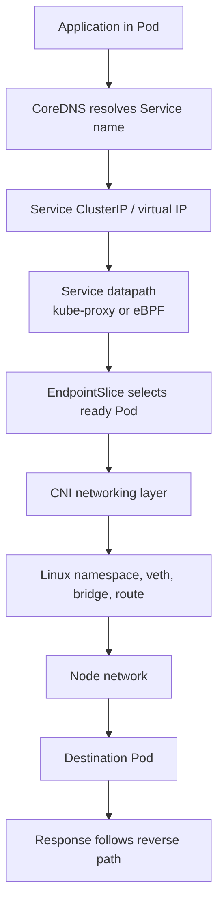
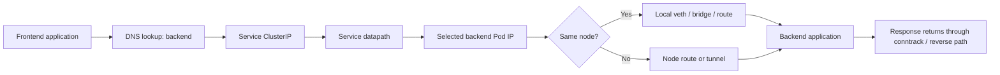
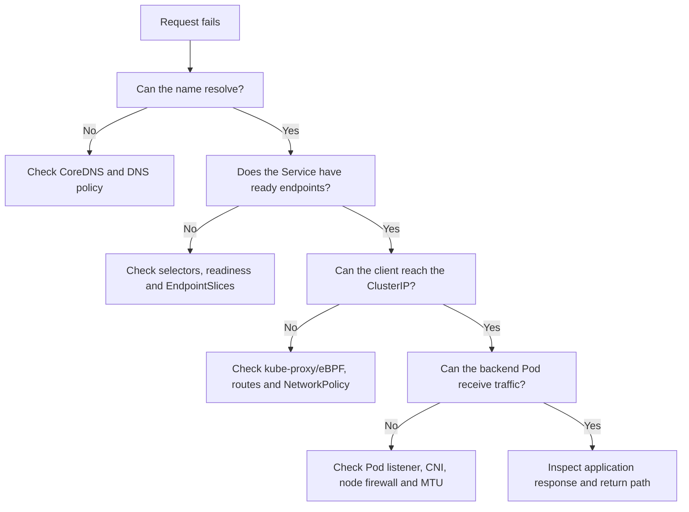
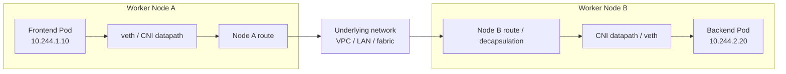
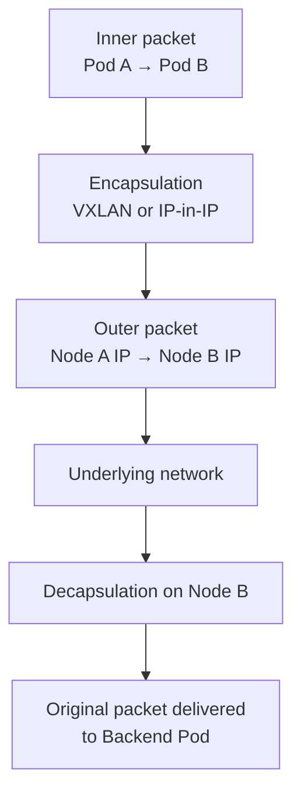
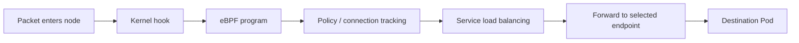
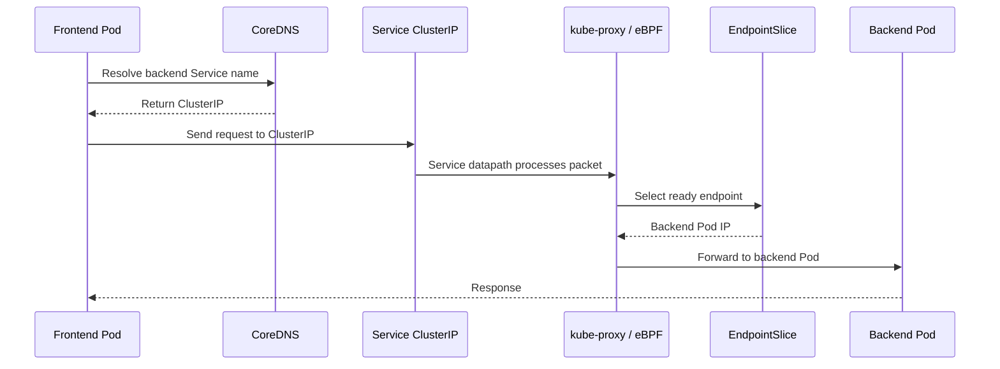
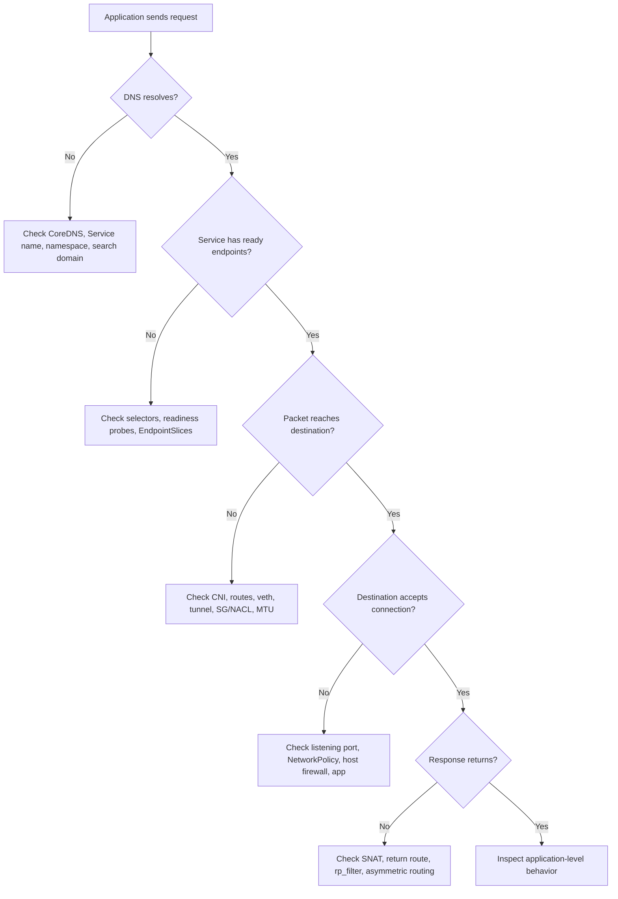

# Kubernetes Networking: Complete Pod-to-Pod Communication Across Nodes

> **Interview level:** Strong DevOps / Senior DevOps  
> **Learning style:** Architecture → packet journey → Linux networking → Kubernetes abstractions → troubleshooting

## How to use this guide

Do not try to memorize Kubernetes networking as a collection of commands. Build the packet journey in your head:

1. **Where is the source Pod?**
2. **Where is the destination Pod or Service?**
3. **Which interface receives the packet?**
4. **Which route, bridge, tunnel, or native VPC path forwards it?**
5. **Which component performs service load-balancing or policy enforcement?**
6. **How does the response return?**

### The one-page mental model



### The five traffic paths you must understand

| Traffic path | Main concepts to explain |
|---|---|
| Pod → Pod on same node | Network namespace, veth pair, bridge, routing |
| Pod → Pod on different nodes | CNI, node routing, overlay or native routing |
| Pod → Service | ClusterIP, kube-proxy/eBPF, EndpointSlice |
| Pod → external system | Default route, SNAT, NAT gateway, firewall |
| External client → application | LoadBalancer/Ingress, NodePort, Service, backend Pod |

> **Interview rule:** If you can trace a packet from a Pod socket to the destination Pod and then explain the return path, you understand Kubernetes networking at a strong practical level.

---

## 🚦 Start Here: The Story of One Packet

Imagine a frontend Pod calling `http://backend:8080`. The application does **not** think about nodes, veth pairs, VXLAN headers, route tables, or kube-proxy. It simply opens a socket.

Kubernetes networking is the machinery that makes this simple application call possible:



### The “who is responsible?” cheat sheet

| Question | Component to investigate |
|---|---|
| How did the Pod get an IP? | CNI + IPAM |
| How does traffic leave the Pod? | Pod network namespace + veth |
| How does traffic reach another node? | CNI routes, overlay, cloud/VPC routing |
| How does a stable name become an IP? | CoreDNS |
| How does a Service choose a backend? | kube-proxy or eBPF service datapath |
| Why is traffic blocked? | NetworkPolicy, security group, NACL, firewall, host policy |
| Why does a large request fail? | MTU, fragmentation, PMTUD, tunnel overhead |
| Why does the reply disappear? | Conntrack, SNAT, reverse path filtering, asymmetric routing |

> **Make networking interesting:** Every troubleshooting question becomes easier when you ask: **“At which hop did the packet stop?”**

## 🧪 A Practical Lab Mindset

For every networking concept, connect the theory to one observable command:

| Concept | Inspect it with |
|---|---|
| Pod IP and node placement | `kubectl get pods -o wide` |
| Service virtual IP | `kubectl get svc` |
| Selected endpoints | `kubectl get endpointslices` |
| DNS resolution | `nslookup backend` or `dig backend` |
| Pod routes/interfaces | `ip addr`, `ip route` inside the Pod |
| Node routes | `ip route` on the worker node |
| Listening socket | `ss -lntp` |
| Connectivity | `curl`, `nc`, `ping` where appropriate |
| Policy behavior | `kubectl describe networkpolicy` |
| Packet-level evidence | `tcpdump`, CNI flow logs, eBPF observability |

### A repeatable packet investigation



> **Interview habit:** Never jump directly to “restart kube-proxy.” First identify whether the failure is **DNS**, **Service selection**, **forwarding**, **policy**, **application listening**, or **return traffic**.

---

## 1. What problem does Kubernetes networking solve?

A Kubernetes application is usually split across multiple Pods and nodes. The frontend may run on Node A while the backend runs on Node B. Kubernetes networking must allow the frontend to reach the backend without the application knowing where the backend Pod is running.

Kubernetes provides a **logical cluster-wide Pod network**. The actual implementation is provided by the CNI plugin, Linux networking, the node network, cloud networking and sometimes a Service datapath.

### Kubernetes networking requirements

| Requirement | Meaning |
|---|---|
| Every Pod gets an IP | Each Pod receives an address from the Pod network or cloud network |
| Pod-to-Pod communication | Pods can communicate without application-specific routes |
| Cross-node communication | Pods on different nodes can communicate |
| Pod-to-Service communication | Applications can use stable Service IPs and DNS names |
| Service discovery | Applications discover services using DNS |
| Network isolation | NetworkPolicy can restrict allowed traffic when supported |
| External connectivity | LoadBalancers, Ingress and egress mechanisms expose or connect workloads |

> **Important:** Pod IPs are normally reachable inside the cluster according to the CNI design. They are not automatically public Internet addresses.

---

## 2. Important IP addresses

| Address | Meaning | Stability | Example |
|---|---|---|---|
| Pod IP | IP assigned to a Pod | Temporary | `10.244.2.20` |
| Node IP | IP assigned to a worker node | More stable | `192.168.10.12` |
| Service ClusterIP | Virtual IP for a Service | Stable while Service exists | `10.96.20.10` |
| NodePort | Port exposed on every eligible node | Service-level | `30080` |
| LoadBalancer IP/DNS | Cloud or external load-balancer endpoint | Service-level | `internal-alb.example` |
| DNS name | Name resolved by CoreDNS | Application abstraction | `backend.app.svc.cluster.local` |

A Pod IP can change when a Pod is deleted and recreated. Applications should normally use a Service DNS name instead of storing a Pod IP.

---

## 3. The complete architecture

```text
+---------------------------------------------------------------+
|                         Kubernetes Cluster                    |
|                                                               |
|  +-------------------------+   +---------------------------+  |
|  |          Node A         |   |          Node B           |  |
|  |                         |   |                           |  |
|  |  +-------------------+  |   |  +----------------------+ |  |
|  |  | Frontend Pod      |  |   |  | Backend Pod          | |  |
|  |  | 10.244.1.10       |  |   |  | 10.244.2.20          | |  |
|  |  | eth0              |  |   |  | eth0                 | |  |
|  |  +---------+---------+  |   |  +------------+---------+ |  |
|  |            |            |   |               |           |  |
|  |       Pod netns         |   |          Pod netns        |  |
|  |            |            |   |               |           |  |
|  |      veth / CNI         |   |          veth / CNI       |  |
|  |            |            |   |               |           |  |
|  |  +---------v---------+  |   |  +------------v---------+ |  |
|  |  | Node networking   |  |   |  | Node networking      | |  |
|  |  | routes / bridge   |  |   |  | routes / bridge      | |  |
|  |  | iptables / eBPF   |  |   |  | iptables / eBPF      | |  |
|  |  +---------+---------+  |   |  +------------+---------+ |  |
|  +------------|------------+   +-------------|-------------+  |
|               |                          |                    |
|               +------ Underlying network-+                    |
|                      VPC / LAN / fabric                       |
+---------------------------------------------------------------+
```

The diagram is conceptual. Different CNIs may use Linux bridges, routes, tunnels, ENIs, eBPF, macvlan, ipvlan or other mechanisms.

### Pod To Pod Communication on same node


---

# 4. Cross-Node Pod Communication

## 4.1 Scenario

```text
Frontend Pod on Node A
Pod IP: 10.244.1.10
Application port: 5000

Backend Pod on Node B
Pod IP: 10.244.2.20
Application port: 8080
```

The frontend executes:

```bash
curl http://10.244.2.20:8080
```

## 4.2 Cross-Node Pod Communication diagram

```text
+-----------------------+
| Frontend application  |
| 10.244.1.10:5000      |
+-----------+-----------+
            |
            v
+-----------------------+
| Frontend Pod netns    |
| eth0 = 10.244.1.10    |
+-----------+-----------+
            |
            v
+-----------------------+
| CNI datapath Node A   |
| veth / ENI / eBPF     |
+-----------+-----------+
            |
            v
+-----------------------+
| Node A routing        |
| Route to 10.244.2.0/24|
| or encapsulation      |
+-----------+-----------+
            |
            v
+-----------------------+
| Underlying network    |
| VPC / LAN / fabric    |
+-----------+-----------+
            |
            v
+-----------------------+
| Node B routing        |
| Decapsulation if used |
| or eBPF processing    |
+-----------+-----------+
            |
            v
+-----------------------+
| CNI datapath Node B   |
| veth / ENI / bridge   |
+-----------+-----------+
            |
            v
+-----------------------+
| Backend Pod netns     |
| eth0 = 10.244.2.20    |
+-----------+-----------+
            |
            v
+-----------------------+
| Backend application   |
| TCP 8080              |
+-----------------------+
```

## 4.3 Packet-level explanation

1. The frontend application creates a TCP packet.
2. Source IP is normally `10.244.1.10`.
3. Destination IP is `10.244.2.20`.
4. Destination port is `8080`.
5. The packet leaves the frontend Pod network namespace through `eth0`.
6. The CNI connects the Pod interface to the node datapath.
7. Node A checks its routing table or CNI datapath.
8. Node A identifies that `10.244.2.20` belongs to Node B or to a remote Pod CIDR.
9. The packet is routed natively, encapsulated, or processed by eBPF.
10. The underlying network delivers the packet to Node B.
11. Node B decapsulates it if required.
12. Node B delivers it to the backend Pod network namespace.
13. The backend application receives the packet on port `8080`.
14. The response must follow a valid reverse path.

## 4.4 Source and destination addresses

### Native routing example

```text
Original packet:
SRC IP = 10.244.1.10
DST IP = 10.244.2.20

Node A forwards based on a route to 10.244.2.0/24.
```

### Overlay example

```text
Inner packet:
SRC IP = 10.244.1.10
DST IP = 10.244.2.20

Outer packet:
SRC IP = Node-A-IP
DST IP = Node-B-IP
```

The inner packet represents the Pod communication. The outer packet transports it between nodes.

---

# 5. Same-node vs cross-node communication

| Traffic | Typical path | Characteristics |
|---|---|---|
| Pod A → Pod B on same node | Pod netns → node datapath → destination Pod | Usually no physical node-to-node hop |
| Pod A → Pod B on different nodes | Pod netns → Node A → network → Node B → Pod netns | Requires routing, tunneling or cloud datapath |
| Pod → Service | Pod → ClusterIP → Service datapath → endpoint Pod | May involve DNAT/load balancing |
| Pod → Internet | Pod → node/VPC egress → NAT/Internet gateway | Often requires SNAT or cloud egress |

Same-node traffic is not guaranteed to be faster in every environment. CNI implementation, encryption, policy processing and workload placement affect performance.

---

# 6. Pod network namespaces

A Linux network namespace isolates network interfaces, routes, firewall state and sockets.

Each Pod normally has its own network namespace. All containers inside the same Pod share that namespace.

```text
Pod network namespace
├── eth0
├── lo
├── routing table
├── ARP/neighbor table
├── iptables/eBPF-visible datapath
└── /etc/resolv.conf
```

### Containers in the same Pod

```text
+--------------------------------------+
| Pod network namespace                |
|                                      |
|  Container A: localhost:8080         |
|  Container B: localhost:9090         |
|                                      |
|  Shared eth0 and shared Pod IP        |
+--------------------------------------+
```

Containers in the same Pod can communicate using `localhost` because they share the same network namespace.

### Inspect a Pod network namespace

```bash
kubectl exec -it <pod-name> -- ip addr
kubectl exec -it <pod-name> -- ip route
kubectl exec -it <pod-name> -- cat /etc/resolv.conf
kubectl exec -it <pod-name> -- ss -lntp
```

---

# 7. veth pairs

A veth pair is a virtual Ethernet cable with two connected ends. A common Linux CNI design places one end inside the Pod network namespace and the other end in the node namespace.

```text
Node network namespace              Pod network namespace

+-------------------+                +-------------------+
| veth-host         | <------------> | eth0              |
+-------------------+                +-------------------+
```

The Pod sees `eth0`. The node sees the host-side veth interface.

### Important qualification

Not every CNI uses the same mechanism:

| CNI/datapath | Possible mechanism |
|---|---|
| Linux bridge-based CNI | veth pair + bridge |
| Calico | veth, routes, eBPF or other modes |
| Flannel | Often bridge + overlay or host-gw |
| Cilium | veth or native/eBPF datapath depending on mode |
| AWS VPC CNI | ENI/secondary IP-based networking; not the traditional bridge model |
| macvlan/ipvlan designs | Different virtual interface model |

Never say that Kubernetes universally creates a veth pair. Say that **many Linux-based CNIs do**.

---

# 8. What is CNI?

CNI means **Container Network Interface**. It is a standard interface/specification used by container runtimes and networking plugins to configure container network connectivity.

### CNI responsibilities

- Allocate Pod IP addresses.
- Create or attach network interfaces.
- Connect the Pod to the node network.
- Configure routes and neighbors.
- Configure tunnels where required.
- Install eBPF programs where supported.
- Apply NetworkPolicy where supported.
- Release networking resources when the Pod is deleted.

### Common CNIs

| CNI | Important characteristics |
|---|---|
| Calico | Routing, policy, optional VXLAN/IP-in-IP/eBPF modes |
| Flannel | Simple Pod networking, commonly VXLAN or host-gw |
| Cilium | eBPF-based networking, policy and observability |
| Weave Net | Overlay networking and policy capabilities |
| AWS VPC CNI | Pod IPs from VPC networking using ENIs/secondary IPs |

Kubernetes defines the networking model; the CNI implements the actual datapath.

---

# 9. Pod CIDR and IPAM

## 9.1 Pod CIDR

A Pod CIDR is an IP range reserved for Pod addresses.

Example:

```text
Cluster Pod CIDR: 10.244.0.0/16

Node A Pod CIDR: 10.244.1.0/24
Node B Pod CIDR: 10.244.2.0/24
Node C Pod CIDR: 10.244.3.0/24
```

The exact allocation model depends on the cluster and CNI.

## 9.2 IPAM

IPAM means **IP Address Management**. It allocates, tracks and releases addresses.

| IPAM task | Meaning |
|---|---|
| Allocation | Assign an unused IP to a Pod |
| Release | Return the IP after Pod deletion |
| Conflict prevention | Avoid duplicate addresses |
| Capacity tracking | Detect exhaustion |
| Scope management | Track node, subnet or cluster address pools |
| Cloud integration | Allocate ENI or secondary IP resources where required |

## 9.3 IP exhaustion

Possible causes:

- Pod CIDR is too small.
- VPC subnet has no free IPs.
- ENI limits are reached.
- Secondary-IP limits are reached.
- Too many Pods are scheduled on a node.
- CNI IPAM state is stale or broken.
- Pod and VPC CIDRs overlap.

### CIDR overlap problem

```text
VPC CIDR: 10.0.0.0/16
Pod CIDR: 10.0.0.0/16
```

Overlapping ranges create ambiguous routing and can cause traffic to be sent to the wrong destination.

---

## 🎯 Decision Point: Overlay or Native Routing?

Use an overlay when you need a virtual Pod network independent of the underlying network. Prefer native routing when the infrastructure can route Pod CIDRs efficiently and securely. The trade-off is usually **simplicity of reachability versus encapsulation overhead**.

---

# 10. Overlay networking

Overlay networking carries a Pod packet inside another packet.

```text
+------------------------------------------------------+
| Outer packet                                         |
| SRC = Node A IP                                      |
| DST = Node B IP                                      |
|                                                      |
|  +-----------------------------------------------+   |
|  | Inner packet                                  |   |
|  | SRC = Pod A IP                                |   |
|  | DST = Pod B IP                                |   |
|  +-----------------------------------------------+   |
+------------------------------------------------------+
```

### Common encapsulation technologies

- VXLAN
- IP-in-IP
- Geneve in some datapaths
- CNI-specific tunnels

### VXLAN

VXLAN stands for **Virtual Extensible LAN**. It encapsulates Layer-2 frames inside UDP packets, commonly using UDP port `4789`.

Conceptually:

```text
Pod Ethernet frame
        |
        v
VXLAN header
        |
        v
UDP header
        |
        v
Outer IP header
        |
        v
Physical/VPC network
```

### IP-in-IP

IP-in-IP places one IP packet inside another IP packet.

```text
Outer IP header
    SRC = Node A
    DST = Node B

Inner IP header
    SRC = Pod A
    DST = Pod B
```

### Advantages of overlays

- Underlying network does not need to know every Pod CIDR.
- Can simplify connectivity across some networks.
- Provides logical separation from the physical network.

### Disadvantages

- Extra headers.
- Lower effective MTU.
- Encapsulation/decapsulation overhead.
- More complex packet captures.
- Possible firewall requirements for tunnel protocols.
- Potentially higher CPU usage.

---

# 11. Native routing

Native routing means the underlying network knows how to reach Pod IPs or Pod CIDRs without tunnel encapsulation.

```text
10.244.2.0/24  →  Node B
```

### Native routing flow

```text
Pod A
  |
  v
Node A routing table
  |
  v
VPC/LAN route to Pod B CIDR
  |
  v
Node B
  |
  v
Pod B
```

### Advantages

- No tunnel header in the normal path.
- Potentially simpler packet path.
- Better visibility in some network tools.

### Trade-offs

- Requires route programming or cloud-network support.
- Route scale can become a concern.
- Incorrect route propagation breaks traffic.
- Cloud route-table limits may matter.

> Native routing is not automatically faster. Performance depends on the complete CNI, kernel, instance, encryption, packet size and traffic pattern.

---

# 12. Overlay vs native routing

| Feature | Overlay | Native routing |
|---|---|---|
| Outer packet | Yes | Normally no |
| Tunnel headers | Yes | No |
| MTU impact | Higher | Lower in normal path |
| Underlying network awareness | Does not always need Pod routes | Must know Pod routes/IPs |
| Troubleshooting | More complex | Often more direct |
| Route scale | May reduce underlay route requirements | Can increase route requirements |
| Performance | Encapsulation overhead possible | Routing overhead possible |
| Example | VXLAN/IP-in-IP | VPC routes, BGP, host-gw |

---

# 13. AWS VPC CNI in EKS

The AWS VPC CNI commonly assigns Pod IPs from the VPC subnet address space using ENIs and secondary IP addresses.

```text
+----------------------------- VPC subnet ----------------------+
|                                                               |
|  +-------------------+       +-----------------------------+  |
|  | Worker Node A     |       | Worker Node B               |  |
|  | ENI                |       | ENI                         |  |
|  | Node primary IP    |       | Node primary IP              |  |
|  | Pod secondary IP   |       | Pod secondary IP             |  |
|  | Pod secondary IP   |       | Pod secondary IP             |  |
|  | Pod secondary IP   |       | Pod secondary IP             |  |
|  +-------------------+       +-----------------------------+  |
+---------------------------------------------------------------+
```

### Overlay CNI vs AWS VPC CNI

| Feature | Overlay CNI | AWS VPC CNI |
|---|---|---|
| Pod IP source | Pod CIDR/IPAM pool | VPC subnet IP space |
| VPC awareness | Not always required | Native VPC integration |
| Encapsulation | May be used | Normally not required for standard mode |
| Main capacity issue | Pod CIDR/IPAM | Subnet IPs, ENI and secondary-IP limits |
| Cloud security | CNI-dependent | Security Groups, NACLs, route tables |
| Common failure | Tunnel/routes/IPAM | Subnet/ENI/IP allocation |

### AWS VPC CNI components

The `aws-node` DaemonSet runs the CNI agent on nodes.

Useful checks:

```bash
kubectl get daemonset -n kube-system aws-node
kubectl get pods -n kube-system -l k8s-app=aws-node
kubectl logs -n kube-system -l k8s-app=aws-node
```

### AWS VPC CNI failure checklist

- Subnet has free IP addresses.
- Node has available ENI capacity.
- Instance type supports enough secondary IPs.
- IAM permissions are correct.
- `aws-node` Pods are healthy.
- Security Groups allow required traffic.
- NACLs allow forward and return traffic.
- VPC route tables are correct.
- Pod and VPC CIDRs do not overlap.
- Prefix delegation settings are appropriate where used.

---

## ⚡ Performance Lens

The question is not “Is eBPF automatically faster?” The useful question is: **Which work is being avoided, moved, or performed earlier in the datapath?** Compare rule updates, packet traversal, connection tracking, load balancing, observability, and operational complexity.

---

# 14. What is eBPF?

**eBPF means extended Berkeley Packet Filter.** It is a Linux kernel technology that allows verified programs to run at specific kernel hooks without modifying or rebuilding the kernel.

In networking, eBPF programs can inspect, redirect, filter, load-balance and observe packets close to the kernel datapath.

### Traditional packet path

```text
Packet
  |
  v
Linux networking stack
  |
  v
iptables rules
  |
  v
Routing / forwarding
  |
  v
Application or destination Pod
```

### eBPF-enabled packet path

```text
Packet
  |
  v
Kernel hook / eBPF program
  |
  +--> Policy decision
  +--> Service load balancing
  +--> Forwarding decision
  +--> Observability event
  |
  v
Destination Pod or network
```

### Where eBPF can attach

Depending on the program and use case, eBPF can operate at:

- XDP: very early packet processing at the driver layer.
- TC: traffic control ingress/egress hooks.
- Socket hooks.
- Cgroup hooks.
- Tracepoints and kprobes for observability.
- Other kernel-supported attachment points.

### Why eBPF is used in Kubernetes

- Efficient packet processing.
- Service load balancing.
- kube-proxy replacement.
- NetworkPolicy enforcement.
- Transparent encryption in some designs.
- Flow visibility and tracing.
- Lower dependence on large iptables rule sets.

### eBPF does not mean “all traffic bypasses Linux”

eBPF programs still run inside the Linux kernel and must obey kernel verification and attachment rules. The exact path depends on the CNI configuration.

### Cilium and eBPF

Cilium is a Kubernetes networking and security platform that uses eBPF extensively. It can provide:

- Pod connectivity.
- NetworkPolicy.
- Service load balancing.
- kube-proxy replacement.
- Flow visibility through Hubble.
- Identity-aware policy.

### eBPF vs iptables

| Feature | iptables | eBPF |
|---|---|---|
| Main mechanism | Kernel firewall/netfilter rules | Verified kernel programs |
| Service implementation | Common traditional method | Can implement Service datapath |
| Rule scaling | Large rule chains can become expensive | Can use maps and direct lookups |
| Observability | Requires additional tools | Can emit rich flow events |
| kube-proxy replacement | No | Possible with supported CNI |
| Debugging | `iptables-save`, counters | CNI-specific commands, Hubble, bpftool |

### eBPF troubleshooting examples

For Cilium:

```bash
cilium status
cilium connectivity test
cilium service list
cilium endpoint list
cilium monitor
hubble observe
```

The exact commands depend on how the Cilium CLI is installed and configured.

---

# 15. kube-proxy and Service networking

`kube-proxy` traditionally implements Kubernetes Service forwarding using iptables or IPVS.

### Direct Pod traffic

```text
Pod A → Pod B IP
```

Direct Pod-to-Pod traffic does not require Service rules and therefore does not inherently require kube-proxy.

### Service traffic

```text
Pod A → ClusterIP → kube-proxy/eBPF → EndpointSlice → Pod B
```

| Traffic | Traditional kube-proxy involvement |
|---|---|
| Pod IP → Pod IP | Not required |
| Pod → ClusterIP | Usually involved |
| NodePort | Usually involved |
| LoadBalancer Service | Usually involved through Service rules |

Modern CNIs can replace kube-proxy using eBPF. Therefore, kube-proxy is a traditional Service implementation, not a universal requirement for every cluster.

---

# 16. Services and EndpointSlices

A Service provides a stable virtual endpoint for a changing group of Pods.

```text
Frontend Pod
     |
     | backend.app.svc.cluster.local
     v
CoreDNS
     |
     v
Service ClusterIP
     |
     v
Service datapath
     |
     v
EndpointSlice
     |
     +---- Backend Pod 1
     +---- Backend Pod 2
     +---- Backend Pod 3
```

### Service components

| Component | Responsibility |
|---|---|
| Service | Stable virtual endpoint and selector |
| ClusterIP | Virtual IP used inside cluster |
| EndpointSlice | Tracks selected backend endpoints |
| kube-proxy/eBPF | Forwards and load-balances traffic |
| CNI | Provides underlying Pod connectivity |
| CoreDNS | Resolves Service DNS names |

### Useful commands

```bash
kubectl get svc -A
kubectl describe svc <service-name>
kubectl get endpointslice -A
kubectl get endpoints <service-name>
```

A Service with no endpoints may be caused by:

- Selector does not match Pod labels.
- Pods are not Ready.
- Wrong namespace.
- Wrong target port.
- EndpointSlice creation issue.
- Readiness or serving conditions exclude endpoints.

---

# 17. CoreDNS

CoreDNS resolves Kubernetes DNS names. It does not route packets and does not perform Service load balancing.

### Example DNS name

```text
backend.app.svc.cluster.local
```

Meaning:

| Part | Meaning |
|---|---|
| `backend` | Service name |
| `app` | Namespace |
| `svc` | Service domain |
| `cluster.local` | Cluster DNS suffix, commonly used default |

### DNS flow

```text
Application Pod
      |
      | DNS query for backend.app.svc.cluster.local
      v
CoreDNS Service
      |
      v
CoreDNS Pod
      |
      v
Service DNS record / ClusterIP
      |
      v
Application connects to ClusterIP
      |
      v
Service datapath selects endpoint Pod
```

### CoreDNS troubleshooting

```bash
kubectl get pods -n kube-system -l k8s-app=kube-dns
kubectl logs -n kube-system -l k8s-app=kube-dns
kubectl exec -it <pod-name> -- cat /etc/resolv.conf
kubectl exec -it <pod-name> -- nslookup kubernetes.default
kubectl exec -it <pod-name> -- nslookup backend.app.svc.cluster.local
```

Separate the problem into:

1. DNS resolution.
2. Service ClusterIP reachability.
3. Endpoint selection.
4. Pod routing.
5. Application listening state.

---

## 🛡️ Security Lens

Networking answers **“Can packets travel?”** Network security additionally asks **“Should this identity, namespace, Pod, port, and direction be allowed to communicate?”** Treat reachability and authorization as separate checks.

---

# 18. NetworkPolicy

Kubernetes defines the NetworkPolicy API. A NetworkPolicy-capable CNI or policy engine enforces it.

### Policy directions

| Direction | Meaning |
|---|---|
| Ingress | Traffic entering selected Pods |
| Egress | Traffic leaving selected Pods |

### Selectors

| Selector | Purpose |
|---|---|
| `podSelector` | Select Pods by labels in the policy namespace |
| `namespaceSelector` | Select namespaces by labels |
| `ipBlock` | Select CIDR ranges |
| `ports` | Restrict traffic to ports/protocols |

### Default deny ingress

```yaml
apiVersion: networking.k8s.io/v1
kind: NetworkPolicy
metadata:
  name: default-deny-ingress
  namespace: app
spec:
  podSelector: {}
  policyTypes:
    - Ingress
```

### Allow frontend to backend

```yaml
apiVersion: networking.k8s.io/v1
kind: NetworkPolicy
metadata:
  name: backend-ingress
  namespace: app
spec:
  podSelector:
    matchLabels:
      app: backend
  policyTypes:
    - Ingress
  ingress:
    - from:
        - podSelector:
            matchLabels:
              app: frontend
      ports:
        - protocol: TCP
          port: 8080
```

This permits selected frontend Pods to reach selected backend Pods on TCP `8080`, assuming the CNI supports and enforces the policy.

### NetworkPolicy debugging

- Confirm the policy namespace.
- Check selected Pod labels.
- Check source Pod labels.
- Check namespace labels.
- Check ingress and egress directions.
- Check DNS egress permissions.
- Check required ports.
- Confirm the CNI supports enforcement.
- Inspect CNI policy-drop logs or flow tools.

A correct route does not guarantee connectivity if NetworkPolicy denies the packet.

---

# 19. NAT and return traffic

### Direct Pod-to-Pod

Direct Pod-to-Pod traffic normally preserves the Pod source and destination IPs.

### Other paths

| Path | Possible translation |
|---|---|
| Pod → Pod directly | Normally no NAT |
| Pod → ClusterIP | DNAT/service translation may occur |
| Pod → NodePort | DNAT and possibly SNAT |
| Pod → Internet | SNAT/NAT Gateway may be required |
| External client → LoadBalancer | Depends on load-balancer mode and source-preservation settings |

### Return path

```text
Forward:
Pod A → Node A → network → Node B → Pod B

Return:
Pod B → Node B → network → Node A → Pod A
```

A connection may fail even if the forward path works. The reverse path needs:

- Correct routes.
- Correct security rules.
- Correct NetworkPolicy.
- Correct NAT state.
- No asymmetric routing problem.
- No reverse-path-filtering problem.
- No application-level rejection.

---

## 📦 The Hidden Failure: Packets That Are Too Large

A connection can succeed for `curl` health checks and still fail for large responses. That pattern should make you suspect MTU, tunnel overhead, fragmentation, or Path MTU Discovery—not only application code.

---

# 20. MTU: Maximum Transmission Unit

## 20.1 What is MTU?

MTU means **Maximum Transmission Unit**. It is the largest packet payload that an interface can transmit at the IP layer without fragmentation under the relevant network conditions.

For common Ethernet networks, the MTU is often `1500` bytes, but the actual value depends on the network.

```text
MTU = maximum packet size supported by an interface/path
```

## 20.2 Why overlays reduce MTU

Encapsulation adds headers:

```text
Original Pod packet
        +
VXLAN/IP-in-IP/Geneve headers
        =
Larger outer packet
```

If the physical network supports `1500` bytes but the tunnel adds headers, the inner Pod packet must be smaller to avoid fragmentation or drops.

### Conceptual example

```text
Underlay MTU:       1500 bytes
Tunnel overhead:      50 bytes
Effective inner MTU: 1450 bytes
```

The exact overhead depends on the encapsulation and configuration. Do not hardcode `1450` for every cluster.

## 20.3 MTU failure symptoms

- Small packets succeed but large packets fail.
- TCP connections hang.
- HTTPS requests fail intermittently.
- Database connections are unstable.
- Retransmissions increase.
- Packets are fragmented or dropped.
- Some applications work while others fail.
- Path MTU Discovery fails because ICMP messages are blocked.

## 20.4 MTU troubleshooting

```bash
ip link
ip addr
ip -d link show
ip route
```

Check from a Pod where the image contains the tools:

```bash
kubectl exec -it <pod-name> -- ip link
kubectl exec -it <pod-name> -- ip route
```

Test without fragmentation:

```bash
ping -M do -s 1400 <pod-ip>
```

Try smaller sizes:

```bash
ping -M do -s 1300 <pod-ip>
ping -M do -s 1200 <pod-ip>
```

`ping -M do` sets the Don't Fragment bit on Linux. The usable size depends on IP version, headers and path.

## 20.5 MTU remediation

- Configure the CNI MTU correctly.
- Ensure underlay MTU supports the tunnel.
- Allow required ICMP for Path MTU Discovery where appropriate.
- Avoid blocking fragmentation-related control traffic blindly.
- Check VPN, cloud transit and firewall overhead.
- Validate both directions.
- Test large TCP payloads, not only ping.

---

# 21. Reverse path filtering and asymmetric routing

Linux reverse path filtering checks whether the source address of a received packet is reachable through the expected interface.

In complex routing environments, a packet may arrive through an interface different from the kernel's preferred return route. Strict reverse path filtering can drop such traffic.

### Symptoms

- Forward packet appears to arrive.
- Return traffic is missing.
- Traffic works on one node but not another.
- Multi-interface or overlay environments behave inconsistently.

### Investigation

```bash
sysctl net.ipv4.conf.all.rp_filter
sysctl net.ipv4.conf.default.rp_filter
ip route get <source-ip>
```

Do not change `rp_filter` blindly in production. Follow the CNI and operating-system guidance.

---

# 22. Security controls affecting cross-node traffic

| Layer | Possible control | Failure example |
|---|---|---|
| Pod | NetworkPolicy | Backend rejects frontend traffic |
| CNI | Policy engine | eBPF/Calico policy drop |
| Node | Host firewall | Node drops packet |
| Cloud | Security Group | ENI traffic denied |
| Subnet | Network ACL | Stateless ingress/return traffic denied |
| Network | Route table | No route to remote Pod CIDR |
| Tunnel | UDP/protocol rule | VXLAN/IP-in-IP blocked |
| Application | Listener/firewall | Process not listening on expected IP/port |

### AWS-specific note

Security Groups are stateful. Network ACLs are stateless, so both forward and return traffic must be allowed appropriately.

---

# 23. Troubleshooting workflow

## Step 1: Identify Pod IPs and node placement

```bash
kubectl get pods -A -o wide
kubectl describe pod <pod-name>
```

Check:

- Pod IP.
- Node name.
- Pod phase.
- Readiness.
- Restart count.
- Container status.

## Step 2: Check application listening state

```bash
kubectl exec -it <backend-pod> -- ss -lntp
kubectl exec -it <backend-pod> -- curl -v http://127.0.0.1:8080
```

A networking issue is not always a CNI issue. The application may simply be listening on the wrong port or only on `127.0.0.1`.

## Step 3: Inspect Pod networking

```bash
kubectl exec -it <pod-name> -- ip addr
kubectl exec -it <pod-name> -- ip route
kubectl exec -it <pod-name> -- cat /etc/resolv.conf
```

## Step 4: Test direct Pod IP

```bash
kubectl exec -it <frontend-pod> -- curl -v http://<backend-pod-ip>:8080
```

## Step 5: Test Service DNS

```bash
kubectl exec -it <frontend-pod> -- nslookup backend.app.svc.cluster.local
kubectl exec -it <frontend-pod> -- curl -v http://backend.app.svc.cluster.local:8080
```

## Step 6: Inspect Service and EndpointSlices

```bash
kubectl get svc -A
kubectl describe svc <service-name>
kubectl get endpointslice -A
```

## Step 7: Check NetworkPolicy

```bash
kubectl get networkpolicy -A
kubectl describe networkpolicy <policy-name> -n <namespace>
```

## Step 8: Check CNI health

```bash
kubectl get pods -n kube-system -o wide
```

Examples:

```bash
kubectl logs -n kube-system -l k8s-app=calico-node
kubectl logs -n kube-system -l k8s-app=cilium
kubectl logs -n kube-system -l k8s-app=aws-node
```

Labels differ by CNI.

## Step 9: Check node networking

Run on the relevant node:

```bash
ip link
ip addr
ip route
ip neigh
iptables-save
ss -s
```

For tunnel-based CNIs, inspect tunnel interfaces. For eBPF-based CNIs, use CNI-specific status and flow tools.

## Step 10: Check cloud networking

- Security Groups.
- Network ACLs.
- Route tables.
- Subnet IP availability.
- VPC Flow Logs.
- ENI and instance limits.
- Cross-AZ path.
- MTU.
- Host firewall.

---

# 24. Useful observability tools

| Tool | Use |
|---|---|
| `kubectl get events` | Scheduling, CNI and Pod lifecycle events |
| `tcpdump` | Packet capture at interfaces |
| Prometheus | Metrics collection |
| Grafana | Metrics visualization |
| VPC Flow Logs | AWS network accept/reject visibility |
| Cilium Hubble | Flow, identity and policy visibility |
| Calico flow logs | Policy and traffic visibility |
| `iptables-save` | Traditional rule inspection |
| `ip route` | Routing inspection |
| `ss` | Socket/listener inspection |
| `conntrack` | Connection tracking investigation where available |
| `bpftool` | Low-level eBPF inspection where permitted |

Example packet capture:

```bash
sudo tcpdump -ni any host <pod-ip>
sudo tcpdump -ni eth0 port 8080
```

Capture on the correct interface. With overlays, the inner packet may not be visible on every interface without decoding or capture at the appropriate point.

---

# 25. Performance considerations

Cross-node traffic may be affected by:

- Additional network hops.
- Overlay encapsulation.
- Encryption.
- NetworkPolicy processing.
- eBPF or iptables processing.
- Cross-Availability-Zone traffic.
- Node bandwidth limits.
- Packet-per-second limits.
- CPU saturation.
- MTU and fragmentation.
- Application connection reuse.

| Factor | Possible effect |
|---|---|
| Same-node traffic | Often lower latency |
| Cross-node traffic | Additional network hop |
| Overlay | Header and CPU overhead |
| Cross-AZ | Additional latency and possible cloud cost |
| Encryption | CPU overhead |
| High packet rate | Node/CNI capacity pressure |
| Large packets | MTU sensitivity |

Do not assume that moving every Pod to one node is always better. Placement, availability, failure domains and network cost must be balanced.

---

# 26. Common failure scenarios

## Scenario 1: Pod IP is reachable but Service is not

Likely areas:

- Service selector.
- EndpointSlice.
- kube-proxy/eBPF Service datapath.
- ClusterIP rules.
- Service port/targetPort.

## Scenario 2: Same-node works, cross-node fails

Likely areas:

- Node routes.
- Tunnel interface.
- Underlay firewall.
- Security Groups/NACLs.
- CNI health.
- Cross-node NetworkPolicy.
- MTU.

## Scenario 3: Small packets work, large packets fail

Likely areas:

- MTU mismatch.
- Tunnel overhead.
- PMTUD failure.
- ICMP filtering.
- Fragmentation.

## Scenario 4: Pod stuck in ContainerCreating

Likely areas:

- CNI plugin failure.
- IP exhaustion.
- ENI/secondary-IP exhaustion.
- Missing CNI permissions.
- Failed interface creation.
- Node network problem.

## Scenario 5: DNS resolves but request fails

DNS is working. Investigate:

- Service datapath.
- EndpointSlice.
- Pod routing.
- NetworkPolicy.
- Security Groups/NACLs.
- Application listener.

## Scenario 6: Request reaches backend but response does not return

Likely areas:

- Missing reverse route.
- SNAT problem.
- Asymmetric routing.
- Reverse path filtering.
- Stateless NACL.
- Return NetworkPolicy.

---

# 27. Important commands cheat sheet

```bash
# Pod placement and IPs
kubectl get pods -A -o wide
kubectl describe pod <pod> -n <namespace>

# Pod network namespace
kubectl exec -it <pod> -- ip addr
kubectl exec -it <pod> -- ip route
kubectl exec -it <pod> -- cat /etc/resolv.conf
kubectl exec -it <pod> -- ss -lntp

# DNS
kubectl exec -it <pod> -- nslookup kubernetes.default
kubectl exec -it <pod> -- nslookup <service>.<namespace>.svc.cluster.local

# Service
kubectl get svc -A
kubectl describe svc <service> -n <namespace>
kubectl get endpointslice -A

# Policy
kubectl get networkpolicy -A
kubectl describe networkpolicy <policy> -n <namespace>

# CNI
kubectl get pods -n kube-system -o wide
kubectl logs -n kube-system -l k8s-app=aws-node
kubectl logs -n kube-system -l k8s-app=cilium
kubectl logs -n kube-system -l k8s-app=calico-node

# Node networking
ip link
ip addr
ip route
ip neigh
iptables-save
ss -s

# MTU
ip -d link show
ping -M do -s 1400 <pod-ip>

# Packet capture
sudo tcpdump -ni any host <pod-ip>
sudo tcpdump -ni eth0 port 8080
```

---

# 28. Common misconceptions

| Misconception | Correct explanation |
|---|---|
| kube-proxy handles every Pod packet | Direct Pod IP traffic does not require Service rules |
| Every Pod always uses a veth pair | Many CNIs do, but AWS VPC CNI and others differ |
| Kubernetes itself implements all networking | CNI, kernel and cloud networking implement the model |
| Pod IPs are public IPs | They are normally internal cluster addresses |
| No NAT exists anywhere | Services and external egress may use translation |
| CoreDNS routes packets | CoreDNS resolves names only |
| NetworkPolicy is enforced by the API server | A compatible CNI/policy engine enforces it |
| eBPF is a separate network | eBPF is a kernel execution technology used by datapaths |
| Native routing is always faster | Performance depends on the complete implementation |
| A forward route proves connectivity | Return routing and security controls also matter |
| DNS success proves application success | DNS, Service, CNI and application checks are separate |
| MTU is always 1500 | MTU depends on the path and encapsulation |

---

# 29. Senior DevOps interview questions

1. Explain the complete packet flow when a Pod on Node A calls a Pod on Node B.
2. What is the Kubernetes networking model?
3. What is CNI and what responsibilities does it have?
4. What is a Pod network namespace?
5. What is a veth pair?
6. Does every CNI create a veth pair?
7. What is a Pod CIDR?
8. What is IPAM?
9. What happens when Pod IPs are exhausted?
10. Explain overlay networking.
11. Explain VXLAN.
12. Explain IP-in-IP.
13. Explain native routing.
14. Compare overlay and native routing.
15. Why does overlay networking reduce MTU?
16. What is MTU?
17. Why can small packets work while large packets fail?
18. What is eBPF?
19. How does eBPF differ from iptables?
20. How can Cilium use eBPF?
21. What is kube-proxy?
22. Why is kube-proxy not required for direct Pod IP traffic?
23. How can eBPF replace kube-proxy?
24. Explain Service traffic versus direct Pod traffic.
25. What is an EndpointSlice?
26. How does CoreDNS participate in application communication?
27. Does CoreDNS route packets?
28. How does NetworkPolicy affect cross-node traffic?
29. Who enforces NetworkPolicy?
30. Explain ingress and egress policy.
31. Explain Pod IP, Node IP and ClusterIP.
32. Explain AWS VPC CNI.
33. Why can EKS Pod IP allocation fail?
34. What are ENI and secondary-IP limits?
35. How would you troubleshoot same-node success but cross-node failure?
36. How would you troubleshoot DNS success but Service failure?
37. How would you troubleshoot a Service with no endpoints?
38. What causes a Pod to remain in ContainerCreating due to networking?
39. Explain forward and reverse traffic paths.
40. What is asymmetric routing?
41. What is reverse path filtering?
42. How do Security Groups and NACLs differ for Pod traffic?
43. How would you investigate MTU problems?
44. How would you observe eBPF network flows?
45. How would you investigate cross-AZ Pod latency?

---

# 30. One-line interview answers

| Question | Answer |
|---|---|
| What is CNI? | A plugin interface and implementation that gives Pods IP addresses and network connectivity. |
| What is Pod CIDR? | An IP range used for Pod addresses, often divided across nodes. |
| What is IPAM? | The mechanism that allocates, tracks and releases Pod IP addresses. |
| What is overlay networking? | Encapsulating a Pod packet inside an outer node-to-node packet. |
| What is native routing? | Forwarding Pod traffic through the underlying network without tunnel encapsulation. |
| What is MTU? | The maximum packet size supported by an interface/path without fragmentation under the relevant conditions. |
| Why does overlay affect MTU? | Tunnel headers consume packet space and reduce the usable inner packet size. |
| What is eBPF? | A Linux kernel technology that runs verified programs at supported hooks for networking, security and observability. |
| What does kube-proxy do? | It traditionally implements Kubernetes Service forwarding using iptables or IPVS. |
| Is kube-proxy required for direct Pod traffic? | No, direct Pod IP traffic does not require Service rules. |
| What does CoreDNS do? | It resolves Kubernetes DNS names; it does not forward packets. |
| Who enforces NetworkPolicy? | A compatible CNI or network policy engine. |
| What is AWS VPC CNI? | An EKS CNI that commonly assigns Pod IPs from VPC subnet address space using ENIs and secondary IPs. |
| Why can cross-node traffic fail? | Routes, CNI, tunnels, IPAM, MTU, policy, firewall, cloud networking or return traffic may be wrong. |

---

# 31. Final mental model

```text
Application
   |
   v
DNS name / Service
   |
   v
ClusterIP / EndpointSlice
   |
   v
Service datapath: kube-proxy or eBPF
   |
   v
Pod IP routing through CNI
   |
   v
Same-node path OR cross-node path
   |
   v
Native routing OR overlay encapsulation
   |
   v
Node network / VPC / LAN
   |
   v
Destination Pod network namespace
   |
   v
Application listener
```

> **Remember:** Kubernetes defines the networking model. CNI allocates and connects Pod networking. The node kernel forwards packets. Services provide stable endpoints. CoreDNS resolves names. kube-proxy or eBPF implements Service forwarding. NetworkPolicy controls allowed traffic. MTU, routes, firewalls and return traffic determine whether the packet actually succeeds.

---

## Interview Accelerator: Common Traps

### 1. Pod IP is not the same as Service IP

- A **Pod IP** identifies a specific Pod network endpoint and is normally temporary.
- A **Service ClusterIP** is a stable virtual address used to reach a group of Pods.
- A Service does not normally run an application process listening on the ClusterIP. The Service datapath redirects or load-balances traffic to an endpoint.

### 2. kube-proxy is not necessarily the packet-forwarding mechanism

`kube-proxy` traditionally programs iptables or IPVS rules. Some clusters use an eBPF-based datapath that can provide Service handling and policy enforcement without relying on kube-proxy in the traditional way.

### 3. CNI is more than “assigning an IP”

A CNI implementation may be responsible for:

- Creating the Pod interface.
- Connecting the Pod namespace to the node network.
- Allocating Pod addresses.
- Installing routes or tunnel state.
- Applying network policy.
- Integrating with the cloud network.

### 4. Cross-node communication is not automatically overlay networking

Cross-node traffic may use:

- Native routing through the underlying network.
- VXLAN or another overlay tunnel.
- IP-in-IP encapsulation.
- Cloud-native ENI/VPC routing.
- An eBPF forwarding datapath.

Always identify the actual CNI and its mode before diagnosing packet flow.

### 5. NetworkPolicy is not a universal firewall

NetworkPolicy behavior depends on the networking implementation supporting it. Also distinguish:

- Ingress policy: traffic entering a selected Pod.
- Egress policy: traffic leaving a selected Pod.
- Namespace selectors: select namespaces using labels.
- Pod selectors: select Pods using labels.
- IP blocks: select CIDR ranges, subject to implementation behavior.

---

## 4.3 Cross-node packet flow at a glance



## 4.4 Overlay networking: what changes?



The application still sends traffic to the destination Pod IP. The overlay adds an outer transport header so the underlying network can carry the packet between nodes.

## 4.5 eBPF service and forwarding datapath



## 4.6 CoreDNS and Service request sequence



## Practical Packet-Journey Checklist

When a request fails, walk through the following sequence:



### Useful evidence to collect

```bash
kubectl get pods -o wide
kubectl get svc,endpoints,endpointslices
kubectl describe svc <service-name>
kubectl describe pod <pod-name>
kubectl get networkpolicy -A
kubectl exec -it <pod-name> -- ip addr
kubectl exec -it <pod-name> -- ip route
kubectl exec -it <pod-name> -- nslookup <service-name>
kubectl exec -it <pod-name> -- curl -v http://<service-name>:<port>
```

On the node, where permitted:

```bash
ip addr
ip route
ip neigh
ip link
ss -lntup
sudo tcpdump -ni any host <pod-ip>
```

> **Diagnostic principle:** First prove whether the failure is DNS, Service selection, packet forwarding, policy, transport, or application behavior. Do not change multiple layers at once.

## Final Mental Test

You should be able to answer these without looking at notes:

1. How does a Pod receive an IP address?
2. What creates the Pod interface inside the network namespace?
3. What is the role of the veth pair?
4. How does same-node Pod traffic differ from cross-node traffic?
5. What changes when the CNI uses VXLAN?
6. What changes when the CNI uses native AWS VPC routing?
7. Why is a Service ClusterIP called virtual?
8. How does kube-proxy or eBPF select a backend?
9. Where does CoreDNS fit into the request path?
10. Why can a TCP connection fail even when DNS works?
11. How can MTU or fragmentation break only some requests?
12. How do NetworkPolicy and cloud security groups differ?
13. Why can the forward path work while the response path fails?
14. Which commands prove the Pod route, node route, Service endpoints, and DNS behavior?

> **Senior-level answer pattern:** Explain the logical Kubernetes abstraction first, then map it to the actual implementation: CNI, Linux namespace, veth, bridge, route, tunnel/ENI, Service datapath, policy, and return traffic.
