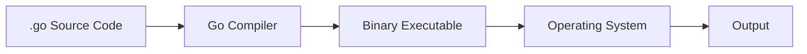
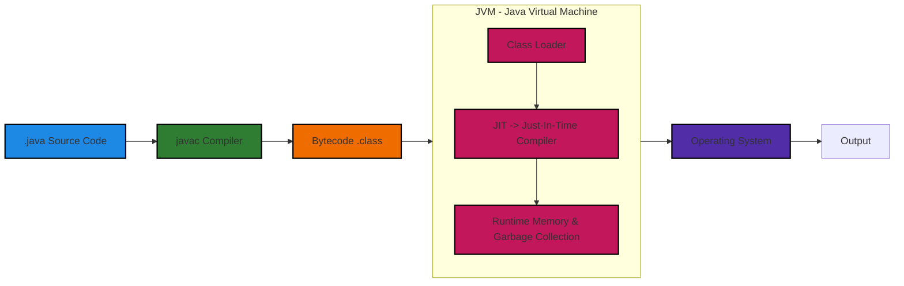
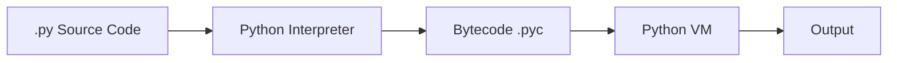

## 🎤 Mock Interview Question 1

### ❓ Question:

Can you explain how execution works in Go and how it is different from Java and Python?

---

### 🧑‍💻 Answer:

In Go, execution follows a **direct compilation model**, whereas Java uses a **JVM-based execution model**, and Python follows an **interpreted execution model**.

---

### 🐹 Go Execution

When we run:

```bash
go build main.go
```

The Go compiler converts the source code (`.go` files) directly into a **native binary executable** which runs directly on the operating system.



👉 Go has **no JVM and no intermediate layer**.

---

### ☕ Java Execution

Java follows a two-step execution process.

```bash
javac Hello.java
java Hello
```



👉 In Java, bytecode enters the **JVM (Java Virtual Machine)** where:

* **Class Loader** loads `.class` files
* **JIT (Just-In-Time) Compiler** converts bytecode into native machine code at runtime
* **Runtime** handles memory management and garbage collection

---

### 🐍 Python Execution

```bash
python app.py
```



👉 Python uses an interpreter and is generally slower.

---
