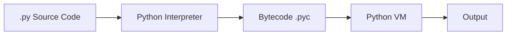
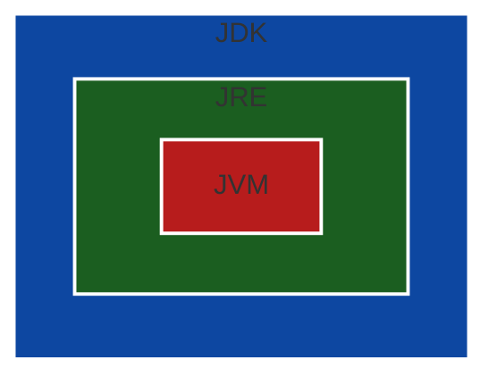

## 🎤 Mock Interview Question 1

### ❓ Question:

Can you explain how execution works in Go and how it is different from Java and Python?

---

### 🧑‍💻 Answer:

In Go, execution follows a **direct compilation model**, whereas Java uses a **JVM-based execution model**, and Python follows an **interpreted execution model**.

---

### 🐹 Go Execution

When we run:

```bash
go build main.go
```

The Go compiler converts the source code (`.go` files) directly into a **native binary executable** which runs directly on the operating system.


👉 Go has **no JVM and no intermediate layer**.

---

### ☕ Java Execution

Java follows a two-step execution process.

```bash
javac Hello.java
java Hello
```



```mermaid
flowchart LR
    A[.java Source Code] --> B[javac Compiler]
    B --> C[Bytecode .class]
    C --> JVM
    %% JVM as a vertical boxed layer
   

    subgraph JVM [JVM - Java Virtual Machine]
        direction TB
        J1[Class Loader]
        J2[JIT -> Just-In-Time Compiler]
        J3[Runtime Memory & Garbage Collection]
        J1 --> J2 --> J3
    end

    JVM --> E[Operating System]
    E --> F[Output]

%% Darkest fills
    style A fill:#2e1065,stroke:#000,stroke-width:2px
    style B fill:#6b0000,stroke:#000,stroke-width:2px
    style C fill:#bf360c,stroke:#000,stroke-width:2px
    style J1 fill:#c2185b,stroke:#000,stroke-width:2px
    style J2 fill:#c2185b,stroke:#000,stroke-width:2px
    style J3 fill:#c2185b,stroke:#000,stroke-width:2px
    style E fill:#512da8,stroke:#000,stroke-width:2px
```

👉 In Java, bytecode enters the **JVM (Java Virtual Machine)** where:

* **Class Loader** loads `.class` files
* **JIT (Just-In-Time) Compiler** converts bytecode into native machine code at runtime
* **Runtime** handles memory management and garbage collection

---

### 🐍 Python Execution

```bash
python app.py
```



👉 Python uses an interpreter and is generally slower.

---

## 🎤 Mock Interview Question 2

### ❓ Question:

What is the role of JVM in Java and how does it achieve platform independence?

---

### 🧑‍💻 Answer:

The **JVM (Java Virtual Machine)** is the core component responsible for executing Java bytecode. It acts as an **abstraction layer between the compiled Java code and the underlying operating system**.

When Java code is compiled using `javac`, it is converted into **bytecode (.class)**. This bytecode is not directly executed by the operating system. Instead, it is executed by the JVM.

---

### 🔍 How JVM Works Internally:

* **Class Loader** loads the `.class` files into memory
* **JIT (Just-In-Time) Compiler** converts bytecode into native machine code at runtime
* **Runtime** manages memory (heap, stack) and performs garbage collection

---

### 🌍 Platform Independence:

Java achieves platform independence using JVM:

> Java code is compiled once into bytecode, and the JVM translates that bytecode into machine-specific instructions for each operating system.

This means:

* Same `.class` file runs on Windows, Linux, and Mac
* Only JVM implementation differs per OS

---

## 🎤 Mock Interview Question 3

### ❓ Question:

What is the difference between JVM, JRE, and JDK?

---

### 🧑‍💻 Answer:

JVM, JRE, and JDK are three core components of Java, and they are often confused, but each has a distinct role in the Java ecosystem.

---

### 🔹 JVM (Java Virtual Machine)

* Responsible for **executing Java bytecode (.class files)**
* Acts as a **bridge between Java code and the operating system**
* Provides platform independence

---

### 🔹 JRE (Java Runtime Environment)

* Provides **runtime environment to run Java applications**
* Contains:

  * JVM
  * Core libraries (java.lang, java.util, etc.)

👉 JRE = JVM + Libraries

---

### 🔹 JDK (Java Development Kit)

* Used for **developing Java applications**
* Contains:

  * JRE
  * Development tools (compiler, debugger, etc.)

👉 JDK = JRE + Development Tools

---

### 🧠 Relationship Diagram



---

### 🎯 Key Understanding

* JVM runs Java programs
* JRE provides environment to run them
* JDK provides tools to build them

---
## 🎤 Mock Interview Question 4

### ❓ Question:

How does request flow work in a Go (Golang) microservice using Gin?

---

### 🧑‍💻 Answer:

In a Go microservice (like employee-api), request flow follows a structured pipeline from client to database and back to the client.

The flow is:

> Client → Router → Middleware → Handler → Business Logic → Database → Response

---

### 🔄 Request Flow Diagram


---

### 🔍 Detailed Breakdown:

#### 🔹 Router (Gin)

* Built using the **Gin framework**, which is a lightweight HTTP web framework in Go
* Responsible for mapping incoming HTTP requests to specific endpoints

Example:

```go
router.GET("/employee/:id", api.GetEmployee)
```

👉 Gin internally uses Go’s `net/http` but adds:

* Faster routing
* Middleware support
* JSON handling

---

#### 🔹 Middleware

Middleware is executed **before and/or after the handler**.

Common use cases:

* Logging requests
* Authentication (JWT)
* Error handling
* Request validation

Example:

```go
router.Use(gin.Logger())
router.Use(gin.Recovery())
```

👉 Multiple middleware form a **chain**.

---

#### 🔹 Handler (api/ layer)

* Entry point of business processing
* Extracts parameters from request
* Calls business logic

Example:

```go
func GetEmployee(c *gin.Context) {
    id := c.Param("id")
    c.JSON(200, gin.H{"id": id})
}
```

---

#### 🔹 Business Logic

* Core logic of application
* Applies rules, validations, transformations
* Keeps handler thin

---

#### 🔹 Database Layer (client/)

* Interacts with databases like ScyllaDB or Redis
* Executes CRUD operations

---

#### 🔹 Response

* Returned in JSON format
* Gin simplifies response creation using `c.JSON()`

---

### 🎯 Key Insight:

This layered request flow provides:

* Clear separation of concerns
* Better maintainability
* Easy debugging and scaling

---
## 🎤 Mock Interview Question 5

### ❓ Question:

What is Viper in Go and why is it used in microservices?

---

### 🧑‍💻 Answer:

**Viper** is a popular configuration management library in Go used to **read, manage, and access application configuration** from different sources.

In microservices, configuration should not be hardcoded. Instead, it should be externalized so that it can be easily changed without modifying the code.

---

### 🔧 Why Viper is Used

Without Viper (bad practice):

```go
port := 8080
host := "localhost"
```

With Viper (good practice):

```yaml
server:
  port: 8080
```

```go
port := viper.GetInt("server.port")
```

👉 This makes the application **flexible and environment-independent**.

---

### 🔄 Configuration Flow


---

### 🔍 Key Features of Viper

* Supports multiple formats:

  * YAML
  * JSON
  * ENV variables

* Can read environment variables:

```bash
export SERVER_PORT=9090
```

* Supports dynamic config changes
* Centralized configuration management

---

### 🧠 Real Use in Your Project

In your employee-api, Viper is used for:

* Server port configuration
* Database connection details
* Redis configuration
* Environment-based settings

---

### 🎯 Key Insight:

Viper helps separate **configuration from code**, making microservices easier to manage, deploy, and scale across different environments.

---
## 🎤 Mock Interview Question 6

### ❓ Question:

What is CRUD and how is it mapped to REST APIs in microservices?

---

### 🧑‍💻 Answer:

If you strip any application down to its core—whether it's a banking system, e-commerce platform, or your employee-api—it’s essentially doing just four operations on data. These four operations are called **CRUD**.

Instead of memorizing it, think of a simple real-world scenario:

👉 You open an employee portal

* You **add a new employee** → that’s **Create**
* You **view employee details** → that’s **Read**
* You **change salary or role** → that’s **Update**
* You **remove an employee** → that’s **Delete**

That’s CRUD in action.

---

Now comes the important part—how this translates into APIs.

In microservices, we don’t expose “create” or “update” as keywords. Instead, we follow **REST standards**, where each operation maps to an HTTP method.

So your system naturally understands intent based on the request type:

* **POST** → "I want to create something"
* **GET** → "I want to read something"
* **PUT / PATCH** → "I want to update something"
* **DELETE** → "I want to remove something"

---

### 💻 How this looks in your Go (Gin) service

```go
router.POST("/employee", createEmployee)       // Create
router.GET("/employee/:id", getEmployee)       // Read
router.PUT("/employee/:id", updateEmployee)    // Update
router.DELETE("/employee/:id", deleteEmployee) // Delete
```

---

### 🔍 What actually happens when a request comes

Let’s say a client hits:

```bash
POST /employee
```

Your system interprets it like this:

* Router → matches the endpoint
* Handler → receives the request
* Business logic → prepares employee data
* Database → inserts record
* Response → confirms creation

Same story repeats for GET, PUT, DELETE—only the intent changes.

---

### 🧠 How to explain this in interview (simple line)

> CRUD represents the four fundamental operations on data, and in REST APIs, these operations are mapped to HTTP methods like POST, GET, PUT, and DELETE.

---
