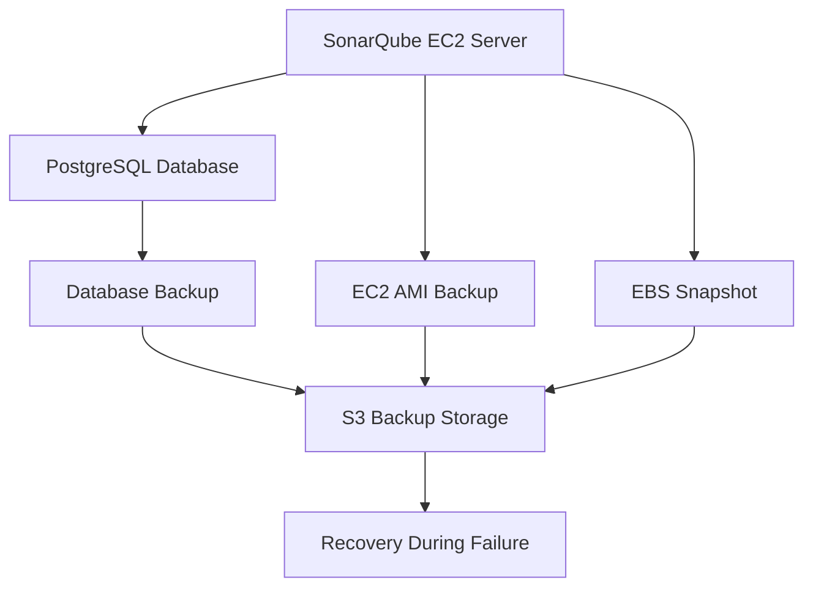

<h1 align="center">Documentation - SonarQube Disaster Recovery on AWS EC2</h1>

<p align="center">
  
</p>

<p align="center">
  <a href="#"></a>
  <a href="#"></a>
  <a href="#"></a>
</p>

<div align="center">

<table>
  <tr>
    <th align="center">Author</th>
    <th align="center">Created On</th>
    <th align="center">Version</th>
    <th align="center">Last Updated By</th>
    <th align="center">Last Edited On</th>
    <th align="center">Pre Reviewer</th>
    <th align="center">L0 Reviewer</th>
    <th align="center">L1 Reviewer</th>
    <th align="center">L2 Reviewer</th>
  </tr>

  <tr>
    <td align="center">Mukesh Kharb</td>
    <td align="center">22/04/2026</td>
    <td align="center">1.0</td>
    <td align="center">Mukesh Kharb</td>
    <td align="center">22/04/2026</td>
    <td align="center">Team</td>
    <td align="center">Mohit Kumar</td>
    <td align="center">Faisal Khan</td>
    <td align="center">Mahesh Kumar</td>
  </tr>
</table>

</div>

---

## Table of Contents

1. [Introduction](#1-introduction)
2. [Important Directories](#2-important-directories)
3. [Backup & Recovery Flow](#3-backup--recovery-flow)
4. [Backup Strategy](#4-backup-strategy)
5. [Recovery Strategy](#5-recovery-strategy)
6. [DR Methods](#6-dr-methods)
7. [MTTR](#7-mttr)
8. [Best Practices](#8-best-practices)
9. [Troubleshooting](#9-troubleshooting)
10. [Contact Information](#10-contact-information)
11. [References](#11-references)

---

## 1. Introduction

This document explains how Disaster Recovery (DR) can be implemented for SonarQube deployed on AWS EC2 servers. It covers backup, recovery, and restoration strategies using PostgreSQL backups, EC2 AMIs, and EBS snapshots to minimize downtime during failures.

---

## 2. Important Directories

| Directory                 | Description                   |
| ------------------------- | ----------------------------- |
| /opt/sonarqube/conf       | SonarQube configuration files |
| /opt/sonarqube/data       | SonarQube application data    |
| /opt/sonarqube/extensions | Plugins and extensions        |
| /opt/sonarqube/logs       | SonarQube logs                |

---

## 3. Backup & Recovery Flow



> Screenshot Placeholder: Add Backup and Recovery Flow Diagram Here

---

## 4. Backup Strategy

| Component           | Backup Method        | Automation          | Frequency |
| ------------------- | -------------------- | ------------------- | --------- |
| PostgreSQL Database | pg_dump              | Cron Job            | Daily     |
| EC2 Server          | AMI Backup           | AWS Backup / Lambda | Weekly    |
| EBS Volume          | Snapshot             | AWS Backup Policy   | Daily     |
| Configuration Files | tar backup + S3 sync | Cron Job            | Weekly    |
| Plugins             | File backup          | Cron Job            | Weekly    |

### PostgreSQL Backup

```bash
pg_dump -U sonar sonarDB > sonarqube_backup.sql
aws s3 cp sonarqube_backup.sql s3://sonarqube-dr-backup/
```

### Automated PostgreSQL Backup Using Cron

```bash
0 1 * * * pg_dump -U sonar sonarDB > /backup/sonar_$(date +\%F).sql
```

The above cron job automatically takes PostgreSQL backup daily at 1 AM.

### SonarQube Configuration Backup

```bash
tar -czvf sonarqube-config.tar.gz \
/opt/sonarqube/conf \
/opt/sonarqube/extensions
```

### EC2 AMI Backup

```bash
aws ec2 create-image \
--instance-id i-xxxxxxxxxxxx \
--name "sonarqube-dr-backup"
```

### EBS Snapshot Backup

```bash
aws ec2 create-snapshot \
--volume-id vol-xxxxxxxx \
--description "SonarQube EBS Backup"
```

EBS snapshots are generally automated using AWS Backup Policies or Lambda scheduled jobs.

---

## 5. Recovery Strategy

| Failure Scenario        | Recovery Method                 |
| ----------------------- | ------------------------------- |
| EC2 Failure             | Launch EC2 from AMI             |
| Database Corruption     | Restore PostgreSQL dump         |
| EBS Failure             | Restore EBS snapshot            |
| Config Corruption       | Restore config backup           |
| Complete Server Failure | Rebuild using AMI and DB backup |

### Database Recovery

```bash
systemctl stop sonarqube
psql -U sonar sonarDB < sonarqube_backup.sql
systemctl start sonarqube
```

### Production Recovery Flow

```text
Failure Detected
       ↓
CloudWatch Alarm Triggered
       ↓
DR Automation Triggered
       ↓
New EC2 Launched from AMI
       ↓
EBS Snapshot Attached
       ↓
PostgreSQL Backup Restored
       ↓
SonarQube Service Started
       ↓
Load Balancer / DNS Updated
       ↓
Service Validation
```

### Production Recovery Implementation

| Step                   | Production Implementation            |
| ---------------------- | ------------------------------------ |
| EC2 Provisioning       | Automated using AMI or Terraform     |
| Volume Recovery        | Automated EBS snapshot restoration   |
| Database Recovery      | Automated PostgreSQL restore scripts |
| Configuration Recovery | Retrieved from S3 or Git repository  |
| Validation             | Health checks and service monitoring |

### EBS Snapshot Recovery Process

```text
Snapshot → New Volume → Attach → Mount → Start Service
```

In production, these steps are generally automated using Lambda, Terraform, Systems Manager Automation, or shell scripts.

---

## 7. MTTR

| Term    | Description                       |
| ------- | --------------------------------- |
| MTTR    | Mean Time To Recovery             |
| Purpose | Measures service restoration time |

```math
MTTR = Total Recovery Time / Number of Incidents
```

| Incident              | Recovery Time |
| --------------------- | ------------- |
| Database Failure      | 30 mins       |
| EC2 Failure           | 45 mins       |
| Configuration Failure | 15 mins       |

Average MTTR = 30 mins

---

## 8. Best Practices

| Practice            | Description                       |
| ------------------- | --------------------------------- |
| Automated Backups   | Schedule regular backups          |
| S3 Backup Storage   | Store backups remotely            |
| Backup Encryption   | Secure backup files               |
| Recovery Testing    | Test restore procedures regularly |
| Snapshot Monitoring | Verify snapshot creation          |
| IAM Security        | Restrict backup permissions       |

---

## 9. Troubleshooting

| Issue           | Cause               | Solution                  |
| --------------- | ------------------- | ------------------------- |
| Backup failed   | S3 permission issue | Check IAM role            |
| Snapshot failed | Invalid volume ID   | Verify EBS volume         |
| Restore failed  | Corrupted backup    | Validate backup integrity |

---

## 10. Contact Information

| Name         | Email                                                                             |
| ------------ | --------------------------------------------------------------------------------- |
| Mukesh Kharb | [mukesh.Kharb.snaatak@mygurukulam.co](mailto:mukesh.Kharb.snaatak@mygurukulam.co) |

---

## 11. References

| S.No | Resource                       | Link                                           |
| ---- | ------------------------------ | ---------------------------------------------- |
| 1    | SonarQube Documentation        | [Click Here](https://docs.sonarsource.com/)    |
| 2    | PostgreSQL Documentation       | [Click Here](https://www.postgresql.org/docs/) |
| 3    | AWS EC2 Documentation          | [Click Here](https://docs.aws.amazon.com/ec2/) |
| 4    | AWS EBS Snapshot Documentation | [Click Here](https://docs.aws.amazon.com/ebs/) |
