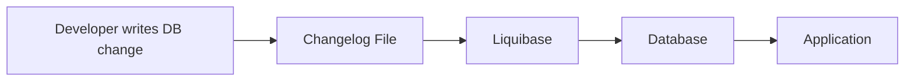

<div align="center">

# Database Change Management | Liquibase POC


</div>

---

| Author       | Created on | Version | Last updated by | Last edited on | Pre Reviewer | L0 Reviewer | L1 Reviewer | L2 Reviewer  |
| ------------ | ---------- | ------- | --------------- | -------------- | ------------ | ----------- | ----------- | ------------ |
| Mukesh Kharb | 22/04/2026 | 1.0     | Mukesh Kharb    | 22/04/2026     | Team         | Mohit Kumar | Faisal Khan | Mahesh Kumar |

---

# 1. Introduction

This document explains how database changes are managed using Liquibase.

Think of Liquibase as:

> "A tool that keeps track of database changes just like Git keeps track of code changes."

### Simple Example

Without Liquibase:

* Developer runs SQL manually
* Another developer forgets to run it
* Database becomes inconsistent

With Liquibase:

* Changes are written once
* Stored in files
* Automatically applied everywhere

---

# 2. What is Database Release Management?

Database Release Management means:

| Activity        | Description                      |
| --------------- | -------------------------------- |
| Change Tracking | Store DB changes in files        |
| Version Control | Maintain history of changes      |
| Deployment      | Apply changes automatically      |
| Rollback        | Undo changes if something breaks |

---

# 3. Pre-requisites

| Component | Requirement         |
| --------- | ------------------- |
| OS        | Ubuntu 22.04        |
| Java      | 11+                 |
| DB        | PostgreSQL          |
| Tool      | Liquibase Installed |

---

# 4. Architecture



### Flow 

1. Developer writes DB change in a file
2. Liquibase reads that file
3. Liquibase updates database
4. Application uses updated database

---

# 5. Directory Structure and File Paths

```bash
liquibase-poc/
├── migration/
│   ├── db.changelog-master.xml
│   ├── 001-create-employee-table.xml
│   └── 002-add-column.xml
├── liquibase.properties
└── scripts/
```

## File Explanation

| File                          | Purpose                    |
| ----------------------------- | -------------------------- |
| db.changelog-master.xml       | Main file (starting point) |
| 001-create-employee-table.xml | Creates table              |
| 002-add-column.xml            | Updates table              |
| liquibase.properties          | DB connection config       |

---

# 6. Step-by-Step Setup

## Step 1 — Install Liquibase

```bash
wget https://github.com/liquibase/liquibase/releases/download/v4.27.0/liquibase-4.27.0.tar.gz
```

---

## Step 2 — Configure liquibase.properties

```properties
url=jdbc:postgresql://localhost:5432/sample_db
username=postgres
password=password
changeLogFile=migration/db.changelog-master.xml
```

---

## Step 3 — Define Changelog (IMPORTANT)

### Main File (Entry Point)

```xml
<databaseChangeLog>
    <include file="migration/001-create-employee-table.xml"/>
</databaseChangeLog>
```

---

### Actual Change File

```xml
<databaseChangeLog>
  <changeSet id="1" author="mukesh">
    <createTable tableName="employee">
      <column name="id" type="INT"/>
      <column name="name" type="VARCHAR(50)"/>
    </createTable>
  </changeSet>
</databaseChangeLog>
```

---

## Step 4 — Run Migration

```bash
liquibase update
```

---

## Step 5 — Verify

```bash
psql -U postgres -d sample_db
\dt
```

---

# 7. Database Release Flow (Real Flow)

| Step | What Happens                 |
| ---- | ---------------------------- |
| 1    | Developer writes change file |
| 2    | File pushed to Git           |
| 3    | Liquibase runs               |
| 4    | DB updated                   |
| 5    | App uses new schema          |

---

# 8. Backup & Rollback

## Backup

```bash
pg_dump sample_db > backup.sql
```

## Rollback

```bash
liquibase rollbackCount 1
```

---

# 9. Best Practices

| Practice           | Why Important           |
| ------------------ | ----------------------- |
| Keep small changes | Easy to debug           |
| Use clear names    | Easy to understand      |
| Test locally       | Avoid production issues |

---

# 10. Key Takeaways

* Liquibase tracks database changes
* Ensures same DB across environments
* Supports rollback
* Works well with automation

---

# 11. Conclusion

Liquibase makes database management:

* Simple
* Reliable
* Automated

Even beginners can manage database changes safely using this approach.

---

# Contact Information

| Name         | Email                                                                             |
| ------------ | --------------------------------------------------------------------------------- |
| Mukesh Kharb | [mukesh.Kharb.snaatak@mygurukulam.co](mailto:mukesh.Kharb.snaatak@mygurukulam.co) |

---

# References

| Source                   | Link                                                                                             |
| ------------------------ | ------------------------------------------------------------------------------------------------ |
| Liquibase Official Docs  | [https://docs.liquibase.com](https://docs.liquibase.com)                                         |
| Liquibase GitHub         | [https://github.com/liquibase/liquibase](https://github.com/liquibase/liquibase)                 |
| PostgreSQL Documentation | [https://www.postgresql.org/docs/](https://www.postgresql.org/docs/)                             |
| JDBC URL Format          | [https://jdbc.postgresql.org/documentation/use/](https://jdbc.postgresql.org/documentation/use/) |

---
