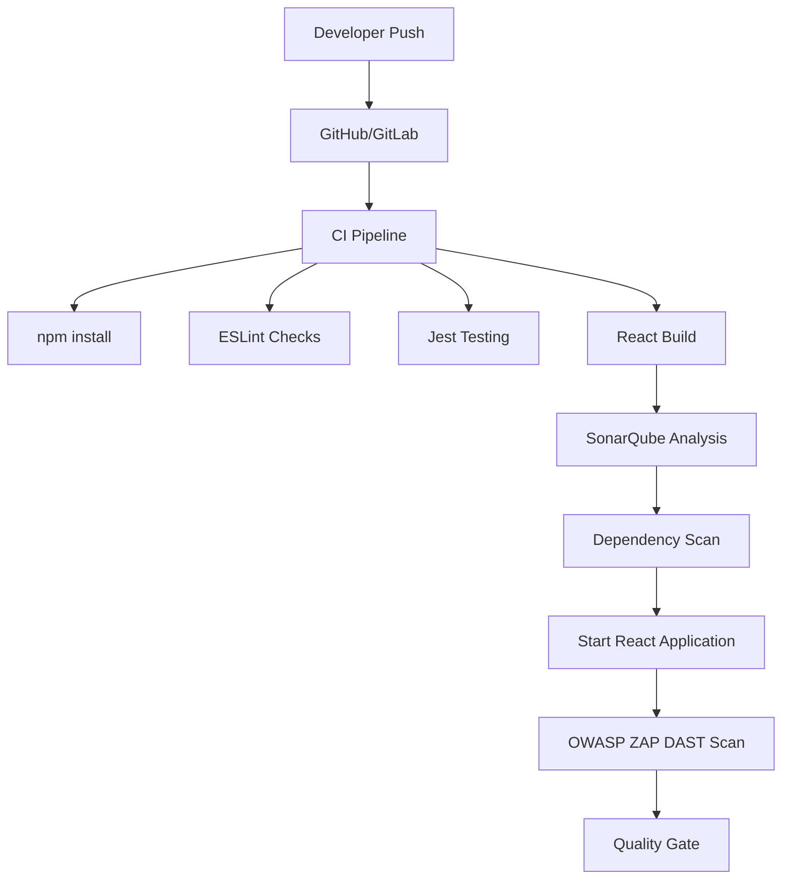

<h1 align="center">Documentation - Application CI Design | React CI Checks | DAST</h1>
<p align="center">
  
</p>
<p align="center">
  <a href="#"></a>
  <a href="#"></a>
  <a href="#"></a>
  <a href="#"></a>
  <a href="#"></a>
</p>


---

<div align="center">

<table>
  <tr>
    <th align="center">Author</th>
    <th align="center">Created On</th>
    <th align="center">Version</th>
    <th align="center">Last Updated By</th>
    <th align="center">Last Edited On</th>
    <th align="center">Pre Reviewer</th>
    <th align="center">L0 Reviewer</th>
    <th align="center">L1 Reviewer</th>
    <th align="center">L2 Reviewer</th>
  </tr>

  <tr>
    <td align="center">Mukesh Kharb</td>
    <td align="center">11/05/2026</td>
    <td align="center">1.0</td>
    <td align="center">Mukesh Kharb</td>
    <td align="center">11/05/2026</td>
    <td align="center">Team</td>
    <td align="center">Mohit Kumar</td>
    <td align="center">Faisal Khan</td>
    <td align="center">Mahesh Kumar</td>
  </tr>
</table>

</div>

---

## Table of Contents

1. [Introduction](#1-introduction)
2. [What is Application CI Design](#2-what-is-application-ci-design)
3. [Why CI Checks are Important](#3-why-ci-checks-are-important)
4. [React CI Workflow](#4-react-ci-workflow)
5. [CI/CD Architecture Diagram](#5-cicd-architecture-diagram)
6. [React CI Checks Explained](#6-react-ci-checks-explained)
7. [DAST (Dynamic Application Security Testing)](#7-dast-dynamic-application-security-testing)
8. [Common Tools Used](#8-common-tools-used)
9. [Tool Comparison](#9-tool-comparison)
10. [Advantages](#10-advantages)
11. [Best Practices](#11-best-practices)
12. [Recommendations & Conclusion](#12-recommendations--conclusion)
13. [Contact Information](#13-contact-information)
14. [References](#14-references)

---

<a id="1-introduction"></a>

## 1. Introduction

Application CI Design helps automate validation, testing, code quality checks, and security scanning for React applications. Integrating CI checks and DAST into development workflows improves software reliability, security, and deployment consistency.

---

<a id="2-what-is-application-ci-design"></a>

## 2. What is Application CI Design

Application CI Design refers to the workflow and architecture used to automatically validate application code during development.

The CI pipeline acts as an automated quality gate that checks whether code is stable, secure, and production-ready before deployment.

---

<a id="3-why-ci-checks-are-important"></a>

## 3. Why CI Checks are Important

## Key Reasons

| Reason               | Description                               |
| -------------------- | ----------------------------------------- |
| Early Bug Detection  | Detects issues before deployment          |
| Faster Feedback      | Developers receive immediate validation   |
| Improved Security    | Identifies vulnerabilities early          |
| Standardization      | Enforces coding standards                 |
| Reliable Builds      | Prevents broken code from progressing     |
| Automation           | Reduces manual validation effort          |
| Better Collaboration | Maintains consistent quality across teams |

---

<a id="4-react-ci-workflow"></a>

## 4. React CI Workflow

```text
Developer Pushes Code
        ↓
GitHub/GitLab Trigger
        ↓
Install Dependencies
        ↓
Lint Checks
        ↓
Unit Testing
        ↓
Build Validation
        ↓
Static Code Analysis
        ↓
Dependency Vulnerability Scan
        ↓
Start React Application
        ↓
DAST Scan
        ↓
Quality Gate Validation
```

---

<a id="5-cicd-architecture-diagram"></a>

## 5. CI/CD Architecture Diagram



---

<a id="6-react-ci-checks-explained"></a>

## 6. React CI Checks Explained

### 1. Dependency Installation

#### Purpose

Installs required project dependencies before execution of validation stages.

#### Example

```bash
npm install
```

---

## 2. Lint Checks

### Tool Used

* ESLint

### Purpose

Linting helps identify:

| Issue Type          | Description                                  |
| ------------------- | -------------------------------------------- |
| Syntax Issues       | Detects invalid syntax and parsing problems  |
| Unused Variables    | Finds variables that are declared but unused |
| Coding Standards    | Enforces consistent coding practices         |
| Formatting Problems | Detects inconsistent formatting              |

## Example

```bash
npm run lint
```

---

# 3. Unit Testing

## Tools Used

* Jest
* React Testing Library

## Purpose

Ensures frontend components and application logic work correctly.

## Example

```bash
npm test
```

---

# 4. Build Validation

## Purpose

Ensures the React application builds successfully without errors.

## Example

```bash
npm run build
```

---

# 5. Static Code Analysis

## Tool Used

* SonarQube

## Purpose

Static analysis checks source code quality without executing the application.

### Common Checks

| Check Type             | Description                              |
| ---------------------- | ---------------------------------------- |
| Code Smells            | Maintainability-related issues           |
| Bugs                   | Logical or implementation issues         |
| Vulnerabilities        | Security-related weaknesses              |
| Duplicate Code         | Repeated code blocks                     |
| Maintainability Issues | Code complexity and readability concerns |

---

# 6. Dependency Vulnerability Scanning

## Tools Used

* npm audit
* Snyk
* Trivy

## Purpose

Scans project dependencies for known security vulnerabilities.

## Example

```bash
npm audit --audit-level=high
```

---

<a id="7-dast-dynamic-application-security-testing"></a>

## 7. DAST (Dynamic Application Security Testing)

## What is DAST?

Dynamic Application Security Testing (DAST) scans a running application to identify runtime vulnerabilities.

Unlike static analysis, DAST tests the application from the outside by simulating real-world attacks.

---

# Why DAST is Important

DAST helps detect vulnerabilities that may not appear during static analysis.

### Examples

| Vulnerability              | Description                                   |
| -------------------------- | --------------------------------------------- |
| Cross-Site Scripting (XSS) | Injection of malicious scripts into web pages |
| SQL Injection              | Unsafe database query manipulation            |
| Authentication Issues      | Weak authentication implementation            |
| Session Misconfiguration   | Improper session handling                     |
| Open Redirects             | Unsafe redirection to malicious sites         |
| Insecure Headers           | Missing security headers                      |
| CSRF Vulnerabilities       | Unauthorized request execution                |

---

# Popular DAST Tools

| Tool       | Type        | Description                       |
| ---------- | ----------- | --------------------------------- |
| OWASP ZAP  | Open Source | Most widely used DAST tool        |
| Burp Suite | Commercial  | Advanced penetration testing      |
| Nikto      | Open Source | Lightweight web scanner           |
| Acunetix   | Commercial  | Enterprise vulnerability scanning |

---

<a id="8-common-tools-used"></a>

## 8. Common Tools Used

| Category        | Tools                    |
| --------------- | ------------------------ |
| Source Control  | GitHub / GitLab          |
| CI Engine       | Jenkins / GitHub Actions |
| Linting         | ESLint                   |
| Testing         | Jest                     |
| Build Tool      | npm / Vite               |
| Code Quality    | SonarQube                |
| Dependency Scan | Snyk / npm audit         |
| DAST            | OWASP ZAP                |

---

<a id="9-tool-comparison"></a>

## 9. Tool Comparison

| Feature           | SonarQube       | ESLint     | OWASP ZAP        |
| ----------------- | --------------- | ---------- | ---------------- |
| Category          | Static Analysis | Linting    | DAST             |
| Security Checks   | Yes             | Limited    | Yes              |
| Runtime Testing   | No              | No         | Yes              |
| Language Support  | Multi-language  | JavaScript | Web Applications |
| CI/CD Integration | Excellent       | Excellent  | Excellent        |
| Open Source       | Yes             | Yes        | Yes              |

---

<a id="10-advantages"></a>

## 10. Advantages

## Benefits of CI Design

| Benefit                     | Description                           |
| --------------------------- | ------------------------------------- |
| Faster Application Delivery | Accelerates software release cycles   |
| Early Issue Detection       | Identifies problems before deployment |
| Better Code Quality         | Maintains clean and maintainable code |
| Improved Security           | Detects vulnerabilities early         |
| Automated Validation        | Reduces manual verification efforts   |
| Reduced Deployment Failures | Prevents unstable releases            |
| Standardized Practices      | Maintains consistency across teams    |
| Improved Productivity       | Reduces repetitive operational tasks  |

---

<a id="11-best-practices"></a>

## 11. Best Practices

## CI Best Practices

| Best Practice             | Description                                 |
| ------------------------- | ------------------------------------------- |
| Fast Pipelines            | Keep CI execution lightweight and efficient |
| Early Failure Detection   | Stop builds immediately on critical issues  |
| Automated Quality Gates   | Enforce quality thresholds automatically    |
| Lint & Test Enforcement   | Validate coding standards and logic         |
| Dependency Scanning       | Continuously scan dependencies for risks    |
| Secret Management         | Avoid exposing credentials in code          |
| Isolated DAST Environment | Run DAST scans in controlled environments   |
| Build Monitoring          | Track build failures and trends             |
| Security Integration      | Include security checks in every pipeline   |
| Version Consistency       | Maintain stable dependency versions         |

---

<a id="12-recommendations--conclusion"></a>

## 12. Recommendations & Conclusion

## Recommended Stack for React Applications

| Area                | Recommended Tool |
| ------------------- | ---------------- |
| CI Engine           | GitHub Actions   |
| Code Quality        | SonarQube        |
| Linting             | ESLint           |
| Unit Testing        | Jest             |
| Dependency Scanning | npm audit / Snyk |
| DAST                | OWASP ZAP        |

---

# Conclusion

A properly designed CI pipeline is essential for modern React applications. Automated checks such as linting, testing, static analysis, dependency scanning, and DAST significantly improve application reliability and security.

Integrating tools like SonarQube and OWASP ZAP into CI workflows helps organizations identify vulnerabilities early, maintain coding standards, and ensure production-ready software delivery.

---

<a id="13-contact-information"></a>

## 13. Contact Information

| Name         | Email                                                                             |
| ------------ | --------------------------------------------------------------------------------- |
| Mukesh Kharb | [mukesh.Kharb.snaatak@mygurukulam.co](mailto:mukesh.Kharb.snaatak@mygurukulam.co) |

---

<a id="14-references"></a>

## 14. References

| S.No | Resource                     | Link                                                          |
| ---- | ---------------------------- | ------------------------------------------------------------- |
| 1    | React Documentation          | [View](https://react.dev/)                                    |
| 2    | SonarQube Documentation      | [View](https://docs.sonarsource.com/sonarqube-server/latest/) |
| 3    | OWASP ZAP Documentation      | [View](https://www.zaproxy.org/docs/)                         |
| 4    | Jenkins Documentation        | [View](https://www.jenkins.io/doc/)                           |
| 5    | GitHub Actions Documentation | [View](https://docs.github.com/en/actions)                    |
| 6    | ESLint Documentation         | [View](https://eslint.org/docs/latest/)                       |
| 7    | Jest Documentation           | [View](https://jestjs.io/docs/getting-started)                |
