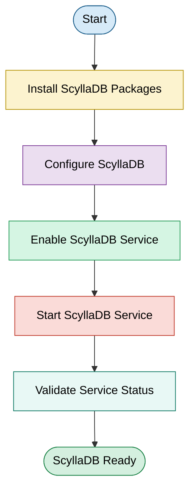
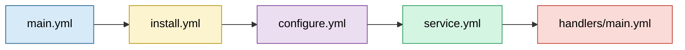

# <h1 align="center">Documentation - Ansible Role | ScyllaDB Installation and Configuration</h1>

<div align="center">

</div>

<br/>

---

<div align="center">

| Author | Created on | Version | Last updated by | Last edited on | PRE Reviewer | L0 Reviewer | L1 Reviewer | L2 Reviewer     |
| ------ | ---------- | ------- | --------------- | -------------- | ------------ | ----------- | ----------- | --------------- |
| Gourav | 26-06-2026 | v1.0    | Gourav          | 26-06-2026     | Team         | Ishaan      | Nikita      | Piyush Upadhyay |

</div>

---

## Table of Contents

1. [Introduction](#1-introduction)
2. [Purpose](#2-purpose)
3. [Role Workflow Diagram](#3-role-workflow-diagram)
4. [Ansible Role Directory Structure](#4-ansible-role-directory-structure)
5. [Role File Description](#5-role-file-description)
6. [Advantages](#6-advantages)
7. [Best Practices](#7-best-practices)
8. [Recommendation / Conclusion](#8-recommendation--conclusion)
9. [FAQs](#9-faqs)
10. [Contact Information](#10-contact-information)
11. [References](#11-references)
---

<a id="1-introduction"></a>

## 1. Introduction

ScyllaDB is a high-performance, distributed NoSQL database that is compatible with Apache Cassandra and is used in the OT-Microservices architecture to provide scalable and reliable data storage for microservices.

The **ScyllaDB Ansible Role** automates the installation, configuration, and service management of ScyllaDB on target hosts. By standardizing the deployment process, the role ensures consistent database provisioning across development, testing, and production environments while reducing manual configuration effort.

---

<a id="2-purpose"></a>

## 2. Purpose

The ScyllaDB Ansible Role is designed to automate the deployment and configuration of ScyllaDB within the OT-Microservices environment. The role provides a standardized approach for provisioning database servers and ensures that every deployment follows the same configuration and operational standards.

The role performs the following activities:

- Installs ScyllaDB packages and required dependencies.
- Configures ScyllaDB using predefined configuration files.
- Enables the ScyllaDB service during system startup.
- Starts the ScyllaDB service after installation.
- Applies consistent configuration across all target servers.
- Validates successful service deployment.

---

<a id="3-role-workflow-diagram"></a>

## 3. Role Workflow Diagram


<a id="4-ansible-role-directory-structure"></a>

## 4. Ansible Role Directory Structure

The ScyllaDB Ansible Role follows the standard Ansible role layout to ensure modularity, maintainability, and reusability. Each directory has a specific responsibility, making the role easier to understand and manage.

```text
roles/
└── scylladb/
    ├── defaults/
    │   └── main.yml
    ├── files/
    ├── handlers/
    │   └── main.yml
    ├── meta/
    │   └── main.yml
    ├── tasks/
    │   ├── main.yml
    │   ├── install.yml
    │   ├── configure.yml
    │   └── service.yml
    ├── templates/
    ├── vars/
    │   └── main.yml
    └── README.md
```

---

<a id="5-role-file-description"></a>

## 5. Role File Description

| File / Directory        | Purpose                                                                                                                                                                  |
| ----------------------- | ------------------------------------------------------------------------------------------------------------------------------------------------------------------------ |
| **defaults/main.yml**   | Defines default variables such as ScyllaDB version, package names, service name, and configuration paths. These values can be overridden by higher-precedence variables. |
| **vars/main.yml**       | Stores role-specific variables that generally remain constant across deployments, such as repository details or platform-specific values.                                |
| **tasks/main.yml**      | Acts as the entry point for the role and imports the individual task files in the required execution order.                                                              |
| **tasks/install.yml**   | Installs ScyllaDB packages, required dependencies, and prepares the target system for database deployment.                                                               |
| **tasks/configure.yml** | Configures ScyllaDB by deploying configuration files, updating parameters, and applying environment-specific settings.                                                   |
| **tasks/service.yml**   | Enables and starts the ScyllaDB service and ensures it remains available after system reboot.                                                                            |
| **handlers/main.yml**   | Defines handlers that restart or reload the ScyllaDB service whenever configuration changes occur.                                                                       |
| **templates/**          | Stores Jinja2 templates used to generate configuration files dynamically based on deployment variables.                                                                  |
| **files/**              | Contains static files required by the role, such as configuration files, scripts, or supporting resources that do not require templating.                                |
| **meta/main.yml**       | Contains role metadata, including author information, supported platforms, dependencies, and Ansible Galaxy details.                                                     |
| **README.md**           | Provides documentation describing the role, prerequisites, variables, execution steps, and usage guidelines.                                                             |

---

## Role Execution Flow



The execution begins with `tasks/main.yml`, which orchestrates the role by importing individual task files. The installation tasks deploy the ScyllaDB packages and dependencies, followed by configuration tasks that apply the required settings. Service management tasks then enable and start ScyllaDB. If any configuration changes occur, the handlers are triggered to restart or reload the service, ensuring that the updated configuration is applied successfully.

<a id="6-advantages"></a>

## 6. Advantages

| Advantage                  | Description                                                            |
| -------------------------- | ---------------------------------------------------------------------- |
| Automated Deployment       | Eliminates manual installation and configuration of ScyllaDB.          |
| Standardized Configuration | Ensures consistent database setup across all target environments.      |
| Reduced Human Error        | Minimizes configuration mistakes through automated provisioning.       |
| Improved Maintainability   | Modular role structure simplifies updates and future enhancements.     |
| Reusable Automation        | The role can be executed multiple times across different environments. |
| Faster Provisioning        | Accelerates deployment by automating repetitive tasks.                 |

---

<a id="7-best-practices"></a>

## 7. Best Practices

| Best Practice                    | Description                                                                             |
| -------------------------------- | --------------------------------------------------------------------------------------- |
| Follow Standard Role Structure   | Organize tasks, variables, handlers, and templates according to Ansible best practices. |
| Use Variables                    | Store configurable values in `defaults` or `vars` instead of hardcoding them.           |
| Keep Tasks Modular               | Divide installation, configuration, and service management into separate task files.    |
| Use Handlers for Service Restart | Restart the ScyllaDB service only when configuration changes occur.                     |
| Verify Service Health            | Verify successful installation and service availability after execution.                |
| Maintain Documentation           | Keep the README updated whenever the role is modified or enhanced.                      |

---

<a id="8-recommendation--conclusion"></a>

## 8. Recommendation / Conclusion

The ScyllaDB Ansible Role provides a standardized and automated approach for deploying and configuring ScyllaDB within the OT-Microservices environment. By following the Ansible role structure and modular design principles, the role simplifies deployment, improves maintainability, and ensures consistent configuration across multiple environments. Adopting this role-based automation reduces manual effort while supporting reliable and repeatable infrastructure provisioning.

---

<a id="9-faqs"></a>

## 9. FAQs

### Q1. Why should ScyllaDB be deployed using an Ansible Role?

**Answer:**

Ansible automates installation and configuration, ensuring consistent deployments while eliminating repetitive manual tasks.

---

### Q2. Why is the role divided into multiple task files?

**Answer:**

Separating installation, configuration, and service management improves readability, simplifies troubleshooting, and makes the role easier to maintain.

---

### Q3. Why are variables stored in `defaults` and `vars`?

**Answer:**

Using variables instead of hardcoded values increases flexibility and allows the same role to be reused across different environments.

---

### Q4. Why are handlers used instead of restarting services in every task?

**Answer:**

Handlers restart or reload the ScyllaDB service only when configuration changes occur, preventing unnecessary service interruptions.

---

### Q5. Can this role be reused for multiple servers?

**Answer:**

Yes. The role is designed to be reusable and can be executed against multiple target hosts through an Ansible inventory.

---

### Q6. Does the role create keyspaces and database users??

**Answer:**

No. This role focuses on installing and configuring ScyllaDB. Keyspaces, roles, users, and application schema should be managed separately after the database service is deployed.

---

<a id="10-contact-information"></a>

## 10. Contact Information

| Name   | ✉️ Contact                                                            |
| ------ | --------------------------------------------------------------------- |
| Gourav | [gourav.sharma.snaatak@mygurukulam.co](mailto:gourav.snaatak@mygurukulam.co) |

---

<a id="11-references"></a>

## 11. References

| S.No | Description                   | Click to View                                                                                                                                                                                                     |
| ---- | ----------------------------- | ----------------------------------------------------------------------------------------------------------------------------------------------------------------------------------------------------------------- |
| 1    | ScyllaDB Documentation        | [](https://opensource.docs.scylladb.com/stable/)                                         |
| 2    | Ansible Roles Documentation   | [](https://docs.ansible.com/ansible/latest/playbook_guide/playbooks_reuse_roles.html)               |
| 3    | Ansible Best Practices        | [](https://docs.ansible.com/ansible/latest/tips_tricks/index.html)                  |
| 4    | ScyllaDB Administration Guide | [](https://opensource.docs.scylladb.com/stable/operating-scylla/index.html) |
